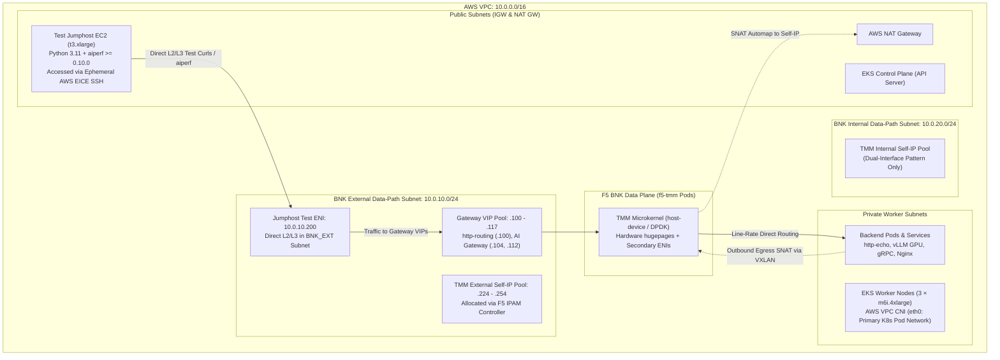
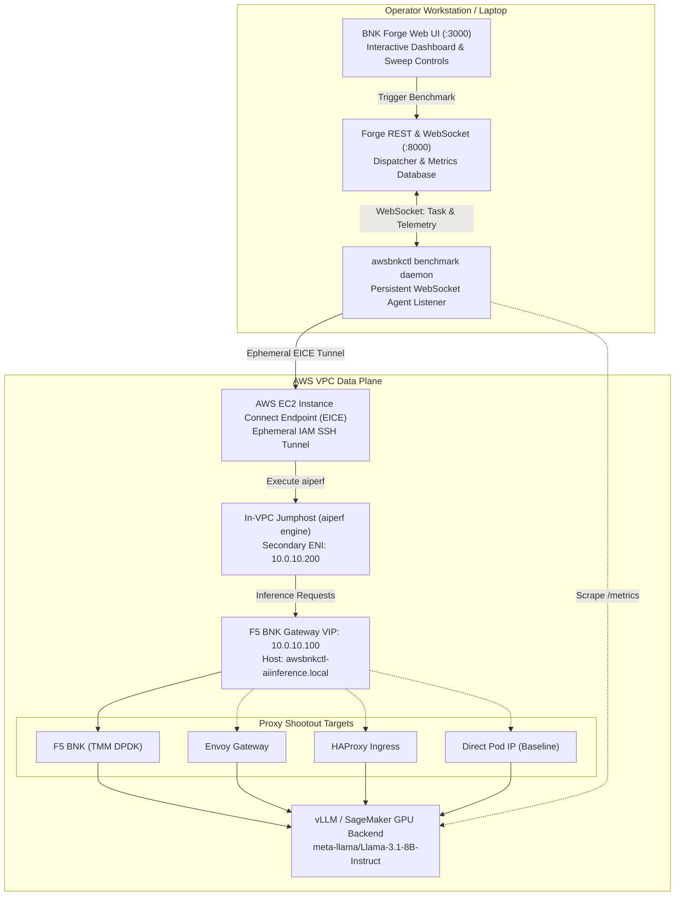
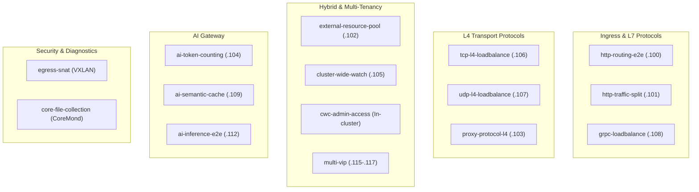
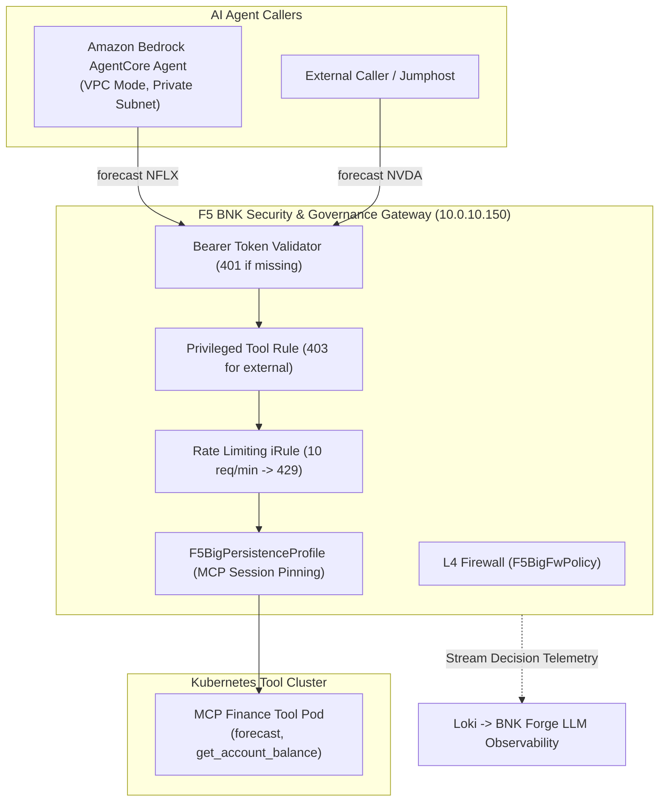

# awsbnkctl


[](https://github.com/JLCode-tech/awsbnkctl/actions/workflows/ci.yml)
[](https://github.com/JLCode-tech/awsbnkctl/releases)
[](LICENSE)

**Deploy, operate, and benchmark F5 BIG-IP Next for Kubernetes (BNK) on AWS EKS from a single binary.**  
Zero Terraform. Zero host `kubectl`. Zero host `helm`.

---

`awsbnkctl` automates the entire lifecycle of enterprise F5 BNK deployments on AWS EKS. From a single declarative `cluster.yaml`, it provisions the AWS VPC, EKS cluster, secondary data-plane ENIs, Multus CNI attachments, hugepages, and the full F5 BNK 2.4 software stack. It includes **15 built-in automated traffic validation scenarios**, an enterprise **AI inference benchmarking suite** (`aiperf`), and **four narrated demonstration walkthroughs**.

---

## Table of Contents

- [Why awsbnkctl? (Stakeholder Value)](#why-awsbnkctl-stakeholder-value)
- [System Architecture & Network Topology](#system-architecture--network-topology)
- [AI Inference Benchmarking & Proxy Shootouts](#ai-inference-benchmarking--proxy-shootouts)
- [15 Built-in Validation Scenarios](#15-built-in-validation-scenarios)
- [Narrated Walkthrough Demos](#narrated-walkthrough-demos)
- [Quick Start](#quick-start)
- [Interface Patterns](#interface-patterns)
- [Pinned Ecosystem Versions](#pinned-ecosystem-versions)
- [CLI Command Taxonomy](#cli-command-taxonomy)
- [Documentation & The `*bnkctl` Family](#documentation--the-bnkctl-family)

---

## Why awsbnkctl? (Stakeholder Value)

| Stakeholder | Key Pain Point Solved | Value Delivered by `awsbnkctl` |
|---|---|---|
| **Enterprise Platform & Network Engineers** | Deploying BNK manually requires stitching together 2,000+ lines of Terraform, Helm charts, AWS CLI calls, and fragile Multus and hugepages host configurations. | **Zero-prerequisite single binary**: Turnkey deployment in ~25 minutes with a deterministic 41-phase state machine. Built-in `awsbnkctl bnk heal` provides self-healing across 10 common Kubernetes plumbing issues. |
| **Cloud & AI Architects** | Traditional K8s ingress controllers (Envoy, NGINX) bottleneck under multi-tenant GenAI workloads and lack hardware-accelerated L4/L7 line-rate isolation. | **Carrier-grade TMM data plane**: Line-rate L4/L7 routing over secondary ENIs, Gateway API native (`gateway.k8s.f5.com`), automated prompt prefix caching, token rate-limiting, and Model Context Protocol (MCP) session persistence. |
| **F5 Solutions Architects & Field SEs** | Setting up repeatable customer PoCs and demonstrating BNK differentiated performance takes days of custom scripting. | **Push-button PoCs & benchmarks**: One command (`up -f cluster.yaml`) brings up a full environment. Built-in `aiperf` benchmarking drives head-to-head shootouts against Envoy, HAProxy, and NGINX with real-time Forge dashboard telemetry. |
| **Sales & Business Leadership** | Cloud PoCs often stall due to high infrastructure cost and leftover unmanaged cloud resources. | **Predictable cost & clean teardown**: Reference cluster runs on-demand for ~$3/hr. AWS tag-based state discovery ensures `down --yes` destroys 100% of provisioned resources with zero orphan residue. |

---

## System Architecture & Network Topology

`awsbnkctl` provisions an AWS VPC with dedicated network segmentation for management and high-performance TMM traffic:



### Key Architectural Tenets
1. **Isolated Data Path**: TMM attaches to dedicated secondary ENIs (`BNK_EXT` on `10.0.10.0/24` and `BNK_INT` on `10.0.20.0/24`) using Multus and Linux host-device (or SR-IOV `vfio-pci`). It bypasses the standard Linux kernel network stack for microsecond packet processing.
2. **Deterministic IP Allocation**: VIPs live in a fixed pool (`.100` through `.117`), the jumphost test client owns `.200`, and TMM self-IPs are managed in a `/27` pool (`.224` through `.254`) by the F5 IPAM controller.
3. **Transparent Outbound Egress**: Outbound pod traffic to external APIs or registries routes over a VXLAN tunnel directly into TMM, where it is SNAT-translated to TMM's external self-IP and forwarded to the AWS NAT Gateway. Pod-to-VPC traffic remains local on the node.
4. **Gateway API Native**: BNK 2.4 uses the modern `gateway.k8s.f5.com` API group (`Gateway`, `HTTPRoute`, `L4Route`, `SecPolicy`, `NetPolicy`, `EgressGateway`, and `Infra`), completely replacing legacy 2.3 CRDs.

---

## AI Inference Benchmarking & Proxy Shootouts

`awsbnkctl` embeds an enterprise-grade AI performance benchmarking engine using NVIDIA's `aiperf`. It measures real-world GenAI latency and throughput from within the VPC and synchronizes with **BNK Forge** for real-time visualization.

### Benchmarking Execution Flow



### Built-in Smoke Presets (`--scenarios`)

| Preset | Concurrency | Requests | ISL (Input) | OSL (Output) | Mode | Target Workload |
|---|:---:|:---:|:---:|:---:|:---:|---|
| `latency` | 1 | 50 | 512 | 128 | Stream | Single-user baseline TTFT without queue delay |
| `throughput` | 32 | 500 | 512 | 128 | Batch | Maximum sustained token throughput under load |
| `long-context` | 4 | 50 | 4096 | 512 | Stream | Memory bandwidth & KV cache expansion test |
| `streaming` | 8 | 200 | 512 | 256 | Stream | Conversational multi-user SSE stream delivery |

### Native Forge Scenarios (`--scenario`)

For exhaustive evaluations and customer bake-offs, `awsbnkctl` supports 8 native synthetic Forge engines plus production trace replay:

- **`baseline`**: Concurrency sweep across 50, 100, 150, 200 concurrent streams.
- **`high-concurrency`**: Heavy prompt pairs up to 300 concurrency with 10k token prompts.
- **`mixed-workload`**: Three-phase adaptive sweep (Warmup $\to$ Short ISL $\to$ Long ISL with prefix sharing).
- **`multi-turn`**: Four-turn conversation simulation with progressively expanding shared prefix (500, 1000, 1500 tokens).
- **`prefix-cache`**: Evaluates KV-cache hit rate and TTFT latency drop across 20 shared prompt pools (80% prefix overlap).
- **`bimodal`**: Two-mode distribution modeling real traffic (70% short 300-token queries, 30% long 4000-token queries).
- **`sustained-load`**: Endurance test running up to 2,500 requests per concurrency step.
- **`burst-recovery`**: 5 rounds alternating between high-load bursts ($c=200$) and low-load probes ($c=25$) to measure queue recovery.
- **`mooncake`**: Open-loop replay of production tool-agent traces with 0.80x time-dilation.

### Multi-Proxy Shootouts (`--proxies`)

Run head-to-head comparisons against Envoy, HAProxy, NGINX, and direct NodePort:

```bash
awsbnkctl benchmark run -f cluster.yaml \
  --proxies f5-bnk,envoy,haproxy,nodeport \
  --scenario baseline,prefix-cache \
  --run-label customer-shootout
```

### GenAI Metrics Captured
- **TTFT (Time to First Token)**: p50, p90, p95, p99 percentiles.
- **ITL (Inter-Token Latency)**: p50, p95, p99 percentiles for streaming chunks.
- **Token Throughput**: Input, output, and aggregate tokens per second.
- **Prefix Cache Hit Rate**: Real-time GPU KV cache hit ratio delta scraped from vLLM/EPP Prometheus metrics.

*(Detailed documentation, Prometheus scrape configuration, and offline regression testing with `benchmark ingest` can be found in [`docs/BENCHMARKS.md`](docs/BENCHMARKS.md).)*

---

## 15 Built-in Validation Scenarios

`awsbnkctl` includes 15 automated validation scenarios covering L4-L7 protocols, hybrid routing, multi-tenancy, AI policies, and outbound egress:



| Category | Scenario | VIP | Verification Method | Status |
|---|---|:---:|---|:---:|
| **L7 Ingress** | `http-routing-e2e` | `.100` | Gateway API HTTPRoute routing to `http-echo` | Green |
| | `http-traffic-split` | `.101` | Weighted canary traffic distribution (70/30 split) | Green |
| | `grpc-loadbalance` | `.108` | gRPC stream load balancing against `kong/grpcbin` | Amber |
| **L4 Transport** | `tcp-l4-loadbalance` | `.106` | Raw TCP proxying via L4Route to nginx marker pods | Green |
| | `udp-l4-loadbalance` | `.107` | Stateless UDP datagram distribution to echo pods | Amber |
| | `proxy-protocol-l4` | `.103` | PROXY protocol v1 header injection via NetPolicy/iRule | Green |
| **Hybrid & Tenancy** | `external-resource-pool` | `.102` | Routing traffic to targets outside EKS (bare metal / RDS) | Green |
| | `cluster-wide-watch` | `.105` | Dynamic tenant namespace routing via single CNE controller | Green |
| | `cwc-admin-access` | – | Client cert + Bearer token auth on CWC admin endpoints | Green |
| | `multi-vip` | `.115`–`.117` | Multi-VIP isolation and concurrent traffic on single ENI | Green |
| **AI Gateway** | `ai-token-counting` | `.104` | Token quota metering and HTTP 503 overload enforcement | Amber |
| | `ai-semantic-cache` | `.109` | Semantic similarity prompt cache hit verification | Amber |
| | `ai-inference-e2e` | `.112` | End-to-end vLLM Llama-3-8B GPU inference (`--synthetic` for CPU) | Green |
| **Security & Egress** | `egress-snat` | – | Transparent pod egress over VXLAN $\to$ TMM AUTOMAP SNAT | Green |
| | `core-file-collection` | – | CoreMond daemon and host crash directory reconciliation | Green |

*(Complete scenario details, traffic sequence diagrams, and VIP maps: [`docs/SCENARIOS.md`](docs/SCENARIOS.md).)*

---

## Narrated Walkthrough Demos & Solutions

Run interactive live demonstrations with narrations and ASCII status visualizers:

```bash
# List all registered demos
awsbnkctl demo list

# Run a live demo
awsbnkctl demo run <demo-name> -f cluster.yaml
```

### Featured: AgentCore AI Tool Governance Demo (`examples/agentcore-demo/`)

Demonstrates enterprise governance of generative AI agents: an **Amazon Bedrock AgentCore** agent making Model Context Protocol (MCP) tool calls is authenticated, rate-limited, firewall-checked, and logged to Loki for real-time Forge observability.



### Built-in Protocol & Ingress Demos

- **`diameter`** (VIP `.110`): Demonstrates telecom Diameter protocol (RFC 6733) load balancing over SCTP/TCP with CER $\leftrightarrow$ CEA capabilities exchange verification.
- **`http2`** (VIP `.111`): Demonstrates high-throughput multiplexed HTTP/2 streaming (`h2c`) with prior knowledge.
- **`bigip-cis`** (VIP `.120`): Contrasts BNK's in-cluster TMM Gateway API against the traditional external BIG-IP Virtual Edition (VE) managed by CIS (`k8s-bigip-ctlr`).
- **`ingress-migration`** (VIP `.113`): Demonstrates zero-downtime side-by-side migration by running `ingress-nginx`, `haproxy-ingress`, and BNK Gateway simultaneously in front of ONE shared backend.

*(All 15 scenarios and 5 demos include individual architecture diagrams in [`docs/SCENARIOS.md`](docs/SCENARIOS.md).)*

---

## Quick Start

### 1. Installation

Download the pre-compiled static binary for your architecture from [GitHub Releases](https://github.com/JLCode-tech/awsbnkctl/releases):

```bash
VERSION=2.3.0
OS=$(uname -s | tr '[:upper:]' '[:lower:]')
ARCH=$(uname -m | sed 's/x86_64/amd64/' | sed 's/aarch64/arm64/')
curl -fsSL "https://github.com/JLCode-tech/awsbnkctl/releases/download/v${VERSION}/awsbnkctl_${VERSION}_${OS}_${ARCH}.tar.gz" | tar -xz
sudo mv awsbnkctl /usr/local/bin/
awsbnkctl version
```

*(You can upgrade anytime with `awsbnkctl self update`, or build locally via `make build` with Go 1.26+).*

### 2. Configure Your Cluster

Copy the reference example:

```bash
cp -r examples/full-cluster my-cluster && cd my-cluster
```

Edit `cluster.yaml` to set your desired AWS region, cluster name, and paths to your F5 FAR container archive and JWT licence token:

```yaml
metadata:
  name: bnk-prod-eks
  region: ap-southeast-2
  azs: [ap-southeast-2a, ap-southeast-2b, ap-southeast-2c]
bnk:
  manifestVersion: "2.4.0"
  farArchive: "/path/to/cne-release-2.4.0.tar.gz"
  jwt: "/path/to/f5-licence.jwt"
```

### 3. Validate & Dry-Run

```bash
# Validate schema and intent locally (zero AWS calls)
awsbnkctl validate cluster.yaml

# Perform a local dry-run plan (skipping AWS credentials check)
AWSBNKCTL_SKIP_AUTH=1 awsbnkctl up -f cluster.yaml --dry-run
```

### 4. Deploy, Test & Destroy

```bash
# 1. Provision VPC, EKS cluster, secondary ENIs, and BNK (~25 minutes)
awsbnkctl up -f cluster.yaml

# 2. Check cluster and BNK health
awsbnkctl status -f cluster.yaml
awsbnkctl doctor -f cluster.yaml --backend k8s

# 3. Run validation scenarios
awsbnkctl scenarios run http-routing-e2e -f cluster.yaml

# 4. Clean teardown with zero orphaned AWS resources
awsbnkctl down -f cluster.yaml --yes
```

---

## Interface Patterns

`awsbnkctl` configures the TMM data-plane network interfaces according to your architecture:

| Pattern | TMM ENIs Provisioned | Recommended Use Case |
|---|---|---|
| **`dual-interface`** *(Default)* | External (`BNK_EXT`) + Internal (`BNK_INT`) | Reference topology. Routes traffic to both K8s pod backends and off-cluster enterprise networks. |
| **`external-only`** | External (`BNK_EXT`) only | Single-arm ingress and transparent pod egress deployments. |
| **`sriov-external`** | External with DPDK over `vfio-pci` | Experimental hardware line-rate throughput benchmarks. |

---

## Pinned Ecosystem Versions

All ecosystem components are pinned to validated, enterprise-tested versions:

| Component | Pinned Version | Config Key / Location | Notes |
|---|:---:|---|---|
| **F5 BNK Release** | `2.4.0` | `bnk.manifestVersion` | Default. Supports 2.3.0–2.3.3 overrides. |
| **Kubernetes (EKS)** | `1.35` | `cluster.kubernetesVersion` | Tested on 1.34 (floor) and 1.35. |
| **cert-manager** | `v1.21.1` | Embedded upstream YAML | Applied via client-go without Helm. |
| **FLO Chart** | `v2.30.0-0.5.2` | `addons.flo.version` | Paired per release in `manifest.KnownReleases`. |
| **Go Runtime** | `1.26` | `go.mod` | Complied with AWS SDK for Go v2 (`v1.42.0`). |

---

## CLI Command Taxonomy

`awsbnkctl` provides 24 top-level commands organized into operational domains:

- **Lifecycle**: `init`, `validate`, `up`, `down`, `status`, `doctor`, `topology`, `version`.
- **Validation Tests**: `test` (`connectivity`, `dns`, `throughput`, `traffic`, `list`, `hosts`).
- **Data Plane Scenarios**: `scenarios` (`list`, `run`, `clean`) — 15 automated validation scenarios.
- **Walkthrough Demos**: `demo` (`list`, `run`, `clean`, `preview`) — 4 narrated protocol walkthroughs.
- **Kubernetes Passthrough**: `k` (`apply`, `delete`, `describe`, `exec`, `get`, `logs`, `port-forward`), aliases `get` and `logs`.
- **BNK Runtime & Self-Healing**: `bnk` (`heal`, `resync`, `upgrade`, `migrate-2.4`, `mcp-session`), `manifest probe`.
  - `bnk heal`: 10-point automated repair suite resolving Multus tokens, metrics-server, TMM log forwarding, EndpointSlice RBAC, and IRSA.
- **AI & Benchmarking**: `benchmark` (`setup`, `run`, `list`, `status`, `daemon`, `ingest`).
- **Fleet & Forge**: `forge` (`register`, `status`, `unregister`, `cleanup`, `scan`, `telemetry`, `benchmark`).
- **Workspaces & Targets**: `workspaces` (`list`, `current`, `new`, `use`, `delete`), `targets` (`scan`, `add`, `list`).

*(Complete command and flag reference: [`docs/COMMANDS.md`](docs/COMMANDS.md)).*

---

## Documentation & The `*bnkctl` Family

### Deep-Dive Guides
- [`docs/ARCHITECTURE.md`](docs/ARCHITECTURE.md) — Phased state machine (41 phases), CNEInstance / Infra / GatewaySettings models, and version policies.
- [`docs/BENCHMARKS.md`](docs/BENCHMARKS.md) — Comprehensive AI inference benchmarking guide, presets, native Forge scenarios, and proxy shootout recipes.
- [`docs/SCENARIOS.md`](docs/SCENARIOS.md) — In-depth breakdown of all 15 scenarios, assertions, and IP plans.
- [`docs/COMMANDS.md`](docs/COMMANDS.md) — Full CLI flags and environment variables reference.
- [`docs/FORGE_INTEGRATION.md`](docs/FORGE_INTEGRATION.md) — Peer-read integration with BNK Forge GUI and telemetry schemas.
- [`docs/UPGRADE-2.4.md`](docs/UPGRADE-2.4.md) — Step-by-step in-place upgrade from BNK 2.3 to 2.4.
- [`docs/BGP-ROUTE-SERVER.md`](docs/BGP-ROUTE-SERVER.md) — BGP dynamic routing and ZebOS Route Server peering.
- [`examples/`](examples/) — Ready-to-deploy reference manifests (`full-cluster`, `egress-demo`, `demo-ai`, `agentcore-demo`).

### The `*bnkctl` Multi-Cloud Family
`awsbnkctl` is part of a unified family of single-binary CLIs bringing declarative F5 BNK management across clouds and on-premises environments:

| Tool | Cloud / Platform | Data Plane Mechanism | Repository |
|---|---|---|---|
| **`awsbnkctl`** | AWS EKS | Secondary ENIs (host-device / SR-IOV DPDK), Multus | [JLCode-tech/awsbnkctl](https://github.com/JLCode-tech/awsbnkctl) |
| **`gkebnkctl`** | GCP GKE | Secondary VPC interfaces (host-device), Multus | [JLCode-tech/gkebnkctl](https://github.com/JLCode-tech/gkebnkctl) |
| **`roksbnkctl`** | IBM Cloud ROKS / OpenShift | IBM Cloud VPC secondary subnets, Calico / OVN | [jgruberf5/roksbnkctl](https://github.com/jgruberf5/roksbnkctl) |
| **`ocibnkctl`** | Local OCI / k3s | Container netns virtio demo mode, Anycast BGP | [mwiget/ocibnkctl](https://github.com/mwiget/ocibnkctl) |
| **`bnkctl-index`** | BNK Forge Catalog | Unified Forge runner module index | [mwiget/bnkctl-index](https://github.com/mwiget/bnkctl-index) |

---

## Contributing & License

Contributions are welcome! Please review [`CONTRIBUTING.md`](CONTRIBUTING.md) for local quality gates (`gofmt`, `go vet`, `staticcheck`, `gosec`, `go test -race`).

Licensed under the [MIT License](LICENSE). © 2026 JLCode-tech.
