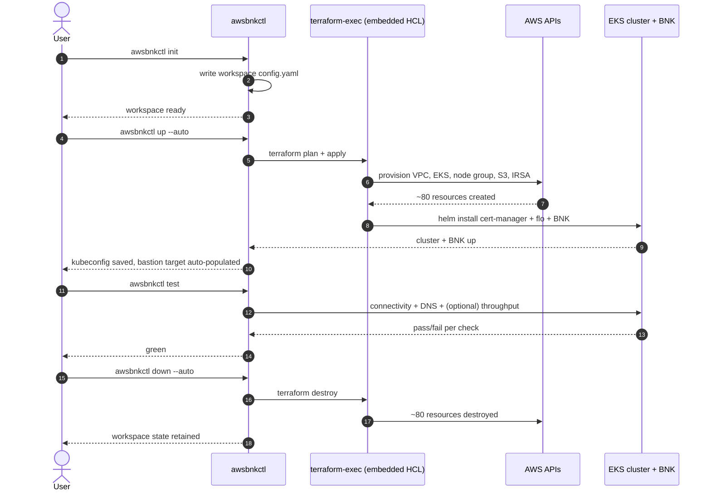

# Quick start: from AWS credentials to deployed BNK

This chapter walks the 4-command lifecycle (`init` → `up` → `test` → `down`) end-to-end. By the time you reach the bottom you'll have a deployed BNK trial on a fresh EKS cluster, a passing connectivity test, and a clean tear-down command ready when you're done.

The lifecycle, at a glance:



The walkthrough assumes:

- You have an `awsbnkctl` binary on `PATH` ([Chapter 4](./04-installation.md)).
- You have **AWS credentials** for an account with permission to create EKS clusters, VPCs, IAM roles, and S3 buckets — resolved via the standard chain (env / shared-config profile / SSO / IMDS).
- `terraform >= 1.5` is on `PATH` and `awsbnkctl doctor` looks healthy ([Chapter 5](./05-doctor.md)).

If `awsbnkctl doctor` is not green for `terraform`, `aws creds`, and `aws sts`, fix those first — nothing below will work otherwise.

> **Note.** The output blocks below are illustrative — version strings, cluster IDs, IPs, and timing all vary between runs. The shape of each step is what to look for.

## Step 1 — set the AWS credentials

The cleanest way to make `awsbnkctl` see your AWS credentials is one of the standard AWS paths:

```bash
# Option A — named profile in ~/.aws/credentials
aws configure --profile awsbnkctl-dev
export AWS_PROFILE=awsbnkctl-dev

# Option B — SSO
aws sso login --profile <sso-profile>
export AWS_PROFILE=<sso-profile>

# Option C — env vars
export AWS_ACCESS_KEY_ID="AKIA..."
export AWS_SECRET_ACCESS_KEY="..."
export AWS_REGION="us-west-2"
```

`awsbnkctl init` will verify the credentials against AWS STS afterwards. See [Chapter 14](./14-credentials-resolver.md) for the full resolution chain (env → shared-config → SSO → IMDS → container task role → web-identity token).

## Step 2 — `awsbnkctl init`

Initialises a workspace under `~/.awsbnkctl/default/` (or under `<name>/` if you pass `-w <name>`). Verifies the credential chain against AWS STS, resolves the region, prompts for the VPC + subnets (or offers to create new ones), the supply-chain S3 bucket name, the FAR archive, and the licence JWT.

```bash
awsbnkctl init
```

Sample interactive session:

```
awsbnkctl init
→ Verifying AWS credentials ... ok (account: 123456789012, arn: arn:aws:iam::123456789012:user/you)
? Workspace name (default):
? AWS region (us-west-2):
? Create new VPC, or use existing? (create new):
? Subnet placement (3 AZs):
? Cluster name (bnk-quickstart):
? Kubernetes version (1.30):
? Node instance types (c5n.4xlarge):
? Node desired size (2):
? Supply-chain S3 bucket name (awsbnkctl-quickstart-bucket):
? Local FAR archive path (./keys/f5-far-auth-key.tgz):
? Local licence JWT path (./keys/trial.jwt):
✓ Wrote ~/.awsbnkctl/default/config.yaml
```

What just happened:

- A workspace called `default` now exists at `~/.awsbnkctl/default/`.
- `config.yaml` records the region, VPC mode, subnet placement, cluster name, K8s version, instance types, node sizing, supply-chain bucket name, and BNK component defaults.
- Credentials are **not** saved by `awsbnkctl` — they live wherever the AWS standard chain finds them (env / `~/.aws/credentials` / SSO cache / instance role). The workspace just records which profile / region it expects.

You can re-run `awsbnkctl init` to update workspace settings; existing values become the prompt defaults.

## Step 3 — `awsbnkctl up --auto`

The deployment. Runs `terraform plan`, runs `terraform apply`, uploads the FAR archive + licence JWT into the supply-chain S3 bucket, generates the admin kubeconfig from EKS, writes it to `~/.kube/config` at mode 0600. The `--auto` flag skips the plan-and-confirm gate; without it `up` shows the plan and asks "apply? [y/N]" before continuing.

```bash
awsbnkctl up --auto
```

Sample output (heavily abridged — a real run is ~30 minutes and prints terraform's full plan + apply log):

```
awsbnkctl up --auto
→ Resolving terraform source ... embedded (v0.9.0)
→ Extracting bundled HCL to ~/.awsbnkctl/default/state/tf-source/embedded-terraform/
→ Pre-creating kubeconfig + scratch directories
→ Rendering auto-tfvars from config.yaml ... ok
→ terraform init -reconfigure
  Initializing provider plugins... done.
→ terraform apply (auto-approved)
  module.eks_cluster.aws_eks_cluster.main: Creating...
  module.eks_cluster.aws_eks_cluster.main: Still creating... [10m elapsed]
  module.eks_cluster.aws_eks_cluster.main: Creation complete after 11m04s
  module.eks_cluster.aws_launch_template.nodes: Creation complete after 5s
  module.eks_cluster.aws_autoscaling_group.nodes: Creation complete after 6m12s
  module.s3_supply_chain.aws_s3_bucket.supply: Creation complete after 4s
  module.iam_irsa.aws_iam_role.flo: Creation complete after 8s
  module.cert_manager.helm_release.cert_manager: Creation complete after 2m11s
  module.flo.helm_release.flo: Creation complete after 4m02s
  module.cne_instance.kubernetes_manifest.cne_instance: Creation complete after 1m42s
  module.license.helm_release.license: Creation complete after 2m18s
  module.testing.tls_private_key.bastion_shared_key: Creation complete after 0s
  module.testing.aws_instance.bastion: Creation complete after 1m48s

  Apply complete! Resources: 82 added, 0 changed, 0 destroyed.

→ Generating kubeconfig for cluster "bnk-quickstart"
✓ Wrote /home/you/.kube/config (chmod 0600)
✓ Auto-registered target jumphost (52.45.91.177); use `awsbnkctl --on jumphost ...`
```

What just happened:

- ~80 resources were created across VPC + EKS cluster + self-managed SR-IOV node group + S3 supply-chain bucket + IRSA roles + cert-manager + FLO + CNE Instance + BNK licence + bastion EC2 instance.
- An admin kubeconfig was generated from EKS's `DescribeCluster` API plus the IAM authenticator config, written at mode 0600. Equivalent to `aws eks update-kubeconfig --name bnk-quickstart --region us-west-2`.
- A `jumphost` target was auto-populated in your workspace config from terraform outputs. This makes [Chapter 16](./16-on-flag-ssh-jumphosts.md)'s `--on jumphost` flag work without any further configuration.

The actual elapsed time on a fresh run is dominated by the EKS control-plane creation (~10-12 min), node group ASG fulfilment (~5-7 min), and the cert-manager + FLO Helm installs (~10 min). Re-runs are dramatically faster because terraform's idempotence skips already-created resources.

## Step 4 — `awsbnkctl status`

Quick sanity check: workspace pointer is right, cluster is reachable, BNK pods are healthy.

```bash
awsbnkctl status
```

Sample output:

```
Workspace: default
Region:    us-west-2
Cluster:   bnk-quickstart — Ready
TF source: embedded (v0.9.0)
Last apply: 2026-05-14T14:22:08Z
Nodes:     2/2 Ready  (c5n.4xlarge × 2; SR-IOV VFs advertised)
BNK pods:  flo (3/3), cis (1/1), cert-manager (3/3), cne-instance (1/1)
```

If anything is not green here, jump to [Chapter 26 — Troubleshooting](./26-troubleshooting.md).

## Step 5 — `awsbnkctl test`

Run the built-in validation suite. Bare `test` runs the connectivity + DNS checks (the throughput test takes a few minutes and is opt-in).

```bash
awsbnkctl test
```

Sample output:

```
awsbnkctl test
→ Suite: connectivity
  ✓ https://www.f5.com (200, 312ms)
  ✓ https://repo.f5.com (200, 88ms)
  ✓ https://eks.us-west-2.amazonaws.com (200, 142ms)
→ Suite: dns
  ✓ www.f5.com → 23.50.149.94 (A, 12ms)
  ✓ repo.f5.com → 52.85.27.231 (A, 18ms)

3 connectivity checks passed; 2 DNS checks passed; 0 failed.
```

For the throughput suite specifically:

```bash
awsbnkctl test throughput --mode east-west
```

Sample output:

```
→ Deploying iperf3 server Pod into namespace "awsbnkctl-test"
✓ Pod ready (iperf3-server-...)
→ Exposing via ClusterIP service
✓ Service ready (cluster-ip: 172.20.45.108:5201)
→ Running iperf3 -c against the service from the k8s client Job
✓ throughput: 14.41 Gbits/sec (mean over 30s)
→ Tearing down iperf3 fixture
✓ pod and service deleted
```

The `--mode east-west` flag uses a `ClusterIP` service and runs the iperf3 client as a Job adjacent to the server for in-cluster traffic; `--mode north-south` (the default) uses an NLB-backed `LoadBalancer` for outside-the-cluster traffic. See [Chapter 22](./22-throughput-testing.md) for the full design.

The connectivity test uses Go's built-in `net/http` — no external `curl` is shelled out — and similarly DNS uses [miekg/dns](https://github.com/miekg/dns). The `--insecure` flag on `test connectivity` skips TLS validation if you need to test against self-signed endpoints.

## Step 6 — explore (optional)

A few useful follow-ups now that the cluster's up:

```bash
# tail the F5 Lifecycle Operator logs
awsbnkctl logs flo -f

# drop into a shell with the workspace's KUBECONFIG + AWS_PROFILE + AWS_REGION exported
awsbnkctl shell

# run a one-shot kubectl with the workspace context loaded
awsbnkctl kubectl get pods -A

# run aws CLI through the auto-discovered bastion
awsbnkctl exec --on jumphost -- aws eks describe-cluster --name bnk-quickstart
```

The `--on jumphost` flag is covered in detail in [Chapter 16](./16-on-flag-ssh-jumphosts.md). It lets you run any of the passthrough commands (`exec`, `shell`, `kubectl`) from inside the VPC — useful when your workstation is behind a corporate firewall that can't reach the EKS public endpoint directly.

## Step 7 — `awsbnkctl down --auto`

Tear it all back down when you're finished. The teardown is `terraform destroy` under the hood, with the same resilience to transient AWS API errors as `up` (e.g., the LoadBalancer-controller-managed ENIs that need explicit ordering at destroy time).

```bash
awsbnkctl down --auto
```

Sample output:

```
awsbnkctl down --auto
→ terraform destroy (auto-approved)
  module.testing.aws_instance.bastion: Destroying...
  module.license.helm_release.license: Destroying...
  module.cne_instance.kubernetes_manifest.cne_instance: Destroying...
  module.flo.helm_release.flo: Destroying...
  module.cert_manager.helm_release.cert_manager: Destroying...
  module.iam_irsa.aws_iam_role.flo: Destroying...
  module.s3_supply_chain.aws_s3_bucket.supply: Destroying...
  module.eks_cluster.aws_autoscaling_group.nodes: Destroying...
  module.eks_cluster.aws_eks_cluster.main: Destroying...
  module.eks_cluster.aws_eks_cluster.main: Still destroying... [5m elapsed]
  module.eks_cluster.aws_eks_cluster.main: Destruction complete after 6m22s

  Destroy complete! Resources: 82 destroyed.

✓ Workspace "default" state retained at ~/.awsbnkctl/default/
  (run `awsbnkctl ws delete default` to remove the workspace dir)
```

`down` retains the workspace dir and config so you can `up` again with the same settings. To remove the workspace entirely:

```bash
awsbnkctl ws delete default
```

This refuses if terraform state still lists resources (use `--force` to override).

## What you just did

In effectively three commands you:

1. Provisioned a fresh EKS cluster with a SR-IOV-capable self-managed node group on AWS.
2. Created an S3 supply-chain bucket + IRSA roles so the F5 Lifecycle Operator can read FAR images and the licence JWT without any static credentials.
3. Installed cert-manager, F5 Lifecycle Operator, and a complete BNK trial on top.
4. Validated the deployment with HTTP connectivity + DNS resolution + (optionally) throughput tests.
5. Got an auto-discovered bastion target ready for any `--on jumphost` follow-ups.

The same flow runs against multiple workspaces, multiple regions, and multiple AWS accounts — see [Chapter 6](./06-workspaces.md) for the multi-environment patterns. From here, [Chapter 16](./16-on-flag-ssh-jumphosts.md) covers the `--on` flag, [Chapter 24](./24-day-2-ops.md) covers day-2 operations, and [Chapter 26](./26-troubleshooting.md) covers what to do when one of the above steps doesn't go right.
