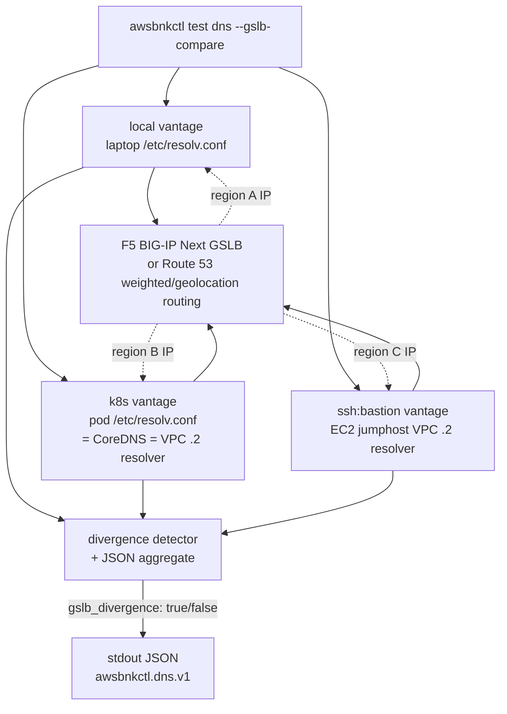

# DNS testing for GSLB

`awsbnkctl test dns` is the diagnostic surface for DNS-driven traffic management — the kind of behaviour an F5 BIG-IP Next GSLB deployment depends on, where the *answer* a name returns is not a single global truth but a function of *who is asking from where*. On an AWS-hosted BNK deployment that frequently means cross-comparing a Route 53 private-hosted-zone answer (the cluster's view, via the VPC's `AmazonProvidedDNS` resolver) against a Route 53 public-hosted-zone answer (the operator laptop's view), or fanning out across multiple egress VPCs to validate that a public GSLB rule is taking effect.

The probe library is [`github.com/miekg/dns`](https://github.com/miekg/dns) — the same DNS implementation CoreDNS uses. The probe and the multi-vantage fan-out implementation live at `internal/test/dns.go` (~540 LOC); the shape is inherited from the upstream fork verbatim and works against AWS-hosted resolvers (Route 53, the VPC's `.2` resolver) without modification.

## Three vantages, one comparison

`--gslb-compare` is the flagship workflow: a single `awsbnkctl test dns` invocation fans out across `local`, `k8s`, and (optionally) `ssh:<target>` vantages, asks each one to resolve the same name, and reports whether the answers diverged.



A single CLI invocation probes from network positions a `dig` from your laptop cannot reach. The k8s vantage answers from the cluster's egress IP (the VPC NAT gateway, or an EKS pod via its node's ENI); the SSH vantage answers from a third network path. Comparing the answers is exactly the assertion "is the GSLB rule taking effect" needs.

## The `awsbnkctl test dns` flag surface

```bash
awsbnkctl test dns \
  [--target <name>] \
  [--type <record-type>] \
  [--server <server-spec>] \
  [--iterations <N>] \
  [--backend <local|k8s|ssh:<target>>] \
  [--gslb-compare] \
  [--require-divergence] \
  [-o json]
```

| Flag | Default | Notes |
|---|---|---|
| `--target` | the workspace's `test.dns.default_target` if set, otherwise required | The DNS name to query; FQDN preferred (the trailing dot is added if missing). |
| `--type` | `A` | Any record type [`miekg/dns`](https://github.com/miekg/dns) recognises via [`dns.StringToType`](https://pkg.go.dev/github.com/miekg/dns#StringToType). The common picks: `A`, `AAAA`, `CNAME`, `MX`, `NS`, `TXT`, `SRV`, `SOA`, `PTR`, `CAA`, `DS`, `DNSKEY`, `ANY`. The full table also covers `HTTPS`, `SVCB`, `TLSA`, `SSHFP`, `URI`, `NAPTR`, `RRSIG`, `NSEC`/`NSEC3`, `LOC`. |
| `--server` | `system` | `system` (host `/etc/resolv.conf`), `cluster` (k8s-backend only — uses the pod's `/etc/resolv.conf`, which is CoreDNS → the VPC's `.2` resolver), a literal `host[:port]`, or a name from `test.dns.resolvers` in workspace config. |
| `--iterations` | `1` | Repeats the same query N times and reports per-iteration RTT plus p50/p95/p99. |
| `--backend` | per-tool default | `local`, `k8s`, or `ssh:<target>`. Docker is rejected at parse time — same network identity as `local`, no GSLB-relevant vantage. |
| `--gslb-compare` | off | Fan out across all configured vantages and emit a comparison JSON. |
| `--require-divergence` | off | Flips the exit code: under `--gslb-compare`, returns non-zero when `gslb_divergence == false`. Lets CI assert "the GSLB *should* be dispatching from here". |
| `-o json` | text | JSON on stdout. Two schemas: `awsbnkctl.dns.v1.vantage` for single-vantage runs, `awsbnkctl.dns.v1` for `--gslb-compare`. |

Why `miekg/dns` and not the standard library's `net.Resolver`:

- **Full record-type surface**. `net.Resolver` only exposes a fixed subset; GSLB validation often needs `CAA` (cert provisioning), `DS`/`DNSKEY` (DNSSEC), `SOA` (authority chain).
- **Per-query server selection**. The standard library hides the upstream resolver behind `/etc/resolv.conf`; we need to point at a specific GSLB VIP or Route 53 resolver.
- **Per-query RTT measurement**. `miekg/dns`'s `Exchange()` returns the round-trip `time.Duration` directly — no scheduling jitter from a stopwatch around the call.
- **EDNS Client Subnet (RFC 7871) round-tripping**. The probe surfaces any ECS option the resolver echoed in the response under `answers[].edns_client_subnet`, so you can confirm the GSLB saw your client's geographic scope rather than the resolver's IP.

## Server resolution

`--server` accepts five forms:

- **Literal IP or `host:port`** — `--server 8.8.8.8`, `--server 1.1.1.1:53`, `--server gslb-vip.example.com:53`. IPv6 must be bracketed: `[2001:4860:4860::8888]:53`. Bare hosts default to port 53.
- **`system`** — reads `/etc/resolv.conf` on the host running the probe. For `--backend local` that is your laptop; for `--backend k8s` that is the pod's resolv.conf (CoreDNS → the VPC's `.2` resolver, which in turn talks to Route 53); for `--backend ssh:<target>` that is the EC2 jumphost's resolv.conf (the VPC's `.2` resolver directly).
- **`cluster`** — `--backend k8s` only; same effect as `system` from inside a pod. The k8s backend rewrites the sentinel before re-dispatching; the local backend errors at parse time.
- **Named resolver from workspace config** — looks up `--server <name>` in `test.dns.resolvers`.

The workspace block:

```yaml
# ~/.awsbnkctl/<workspace>/config.yaml
test:
  dns:
    default_target: www.example.com
    resolvers:
      google:     "8.8.8.8:53"
      cloudflare: "1.1.1.1:53"
      vpc-r53:    "10.0.0.2:53"       # the VPC's .2 resolver, dialled directly
      gslb-vip:   "169.45.91.5:53"
```

## AWS-specific resolver shapes

Two Route 53 surfaces show up in awsbnkctl-tested deployments:

- **Route 53 Resolver (the VPC's `.2` address).** Every VPC gets a built-in resolver at `<vpc-cidr-base>+2` that handles in-VPC name resolution (private hosted zones, AmazonProvidedDNS, Resolver outbound endpoints if configured). Both the EKS pod's `/etc/resolv.conf` (via CoreDNS's upstream) and an EC2 instance's `/etc/resolv.conf` point here. When you probe with `--backend k8s --server cluster` you are asking this resolver; when you probe with `--backend ssh:bastion --server system` you are asking it from a different ENI in the same VPC.
- **Public Route 53 hosted zones.** When the GSLB front is a public name (`*.example.com` with a public hosted zone), the laptop and the cluster see the same authoritative answer modulo the recursive resolver chain in between. Divergence here usually points at a Resolver outbound endpoint forwarding the laptop's query to a private resolver that's overriding the public answer.

For weighted, latency-based, or geolocation routing policies inside Route 53 itself (a Route 53–native form of GSLB), `--gslb-compare` against `--server <route-53-resolver>` from each vantage will show the per-vantage record the policy returned — the probe doesn't need to know about the routing policy, only that the answers differ.

## The `--gslb-compare` workflow

Pass `--gslb-compare` to fan out across all configured vantages and emit a single comparison JSON:

```bash
awsbnkctl test dns \
  --target www.example.com \
  --type A \
  --server gslb-vip.example.com \
  --gslb-compare \
  -o json
```

What happens:

1. The runner enumerates configured vantages: `local` always; `k8s` when a kubeconfig is reachable; plus every entry in the workspace's `targets:` block as `ssh:<name>`.
2. Each vantage runs the same query in sequence. Worst-case wall time with three vantages and the default 2-second per-query timeout is ~6 seconds.
3. Per-vantage results are collected with their full RTT distribution and answer set.
4. The runner compares the answer sets across vantages. The fingerprint is the *sorted `{type, rdata}` tuple list* — TTL is excluded because TTLs vary across resolvers even for identical answers. If the fingerprints differ, `gslb_divergence: true` lands in the output and the summary names the diverging vantages.
5. The output is a single `awsbnkctl.dns.v1` JSON document wrapping one `vantages[]` entry per backend.

`gslb_divergence: true` is **not** a failure signal — for a healthy GSLB it is the *expected* outcome. Exit code is `0` whenever every per-vantage probe succeeded (got an answer, even if the answers differ); `1` when any per-vantage probe failed (NXDOMAIN, SERVFAIL, timeout). Use `--require-divergence` to invert the assertion when CI specifically needs to confirm the GSLB *is* dispatching.

## JSON output

There are two distinct JSON shapes:

- **`awsbnkctl.dns.v1.vantage`** — single-vantage probe. A flat document.
- **`awsbnkctl.dns.v1`** — multi-vantage `--gslb-compare`. Wraps an array of per-vantage entries (each still carries the per-vantage schema string) plus `gslb_divergence` and a one-line summary.

The per-vantage shape carries `backend`, `server`, `iterations`, `rtt_ms.{p50,p95,p99}`, `answers[]` (each with `name`, `type`, `ttl`, `rdata`), `rcode` (`NOERROR`/`NXDOMAIN`/`SERVFAIL`/`TIMEOUT`/`ERROR`), `authoritative`, `truncated`, and an optional `edns_client_subnet` block (RFC 7871) when the resolver echoed an ECS option. See `internal/test/dns.go::DNSProbeResult` for the canonical Go type.

A typical divergence-detected output:

```json
{
  "schema": "awsbnkctl.dns.v1",
  "target": "www.example.com.",
  "type": "A",
  "vantages": [
    { "schema": "awsbnkctl.dns.v1.vantage", "backend": "local",
      "server": "169.45.91.5:53",
      "answers": [{ "rdata": "169.45.91.10" }], "rcode": "NOERROR" },
    { "schema": "awsbnkctl.dns.v1.vantage", "backend": "k8s",
      "server": "10.100.0.10:53",
      "answers": [{ "rdata": "10.20.30.40" }], "rcode": "NOERROR" }
  ],
  "gslb_divergence": true,
  "gslb_divergence_summary": "answers differ across vantages: local [169.45.91.10] vs k8s [10.20.30.40]"
}
```

Both schemas are stable at v1.0 — additive changes (new optional fields, like `edns_client_subnet`) are allowed within `v1`; renames or removals would bump to `.v2`.

## Why `--backend docker` is rejected

A Docker container running locally on the user's laptop has the same network identity as the host (default bridge networking). DNS queries NAT out via the host's interface, so the answer would be identical to `--backend local` — no new vantage. The CLI rejects the combination at parse time with a remediation message pointing at `local`, `k8s`, or `ssh:<target>` instead.

## Worked example: GSLB divergence on an AWS deployment

A customer's GSLB rule says "users in us-east-1 get IP A, users in eu-west-1 get IP B". You run from your laptop in us-west-2 (so neither rule's primary region), against a cluster in us-east-1 and an EC2 bastion in eu-west-1:

```bash
$ awsbnkctl test dns \
    --target www.example.com \
    --type A \
    --server gslb-vip.example.com \
    --gslb-compare -o json | jq '.vantages[] | {backend, answers}'
{ "backend": "local",          "answers": [{ "rdata": "203.0.113.10" }] }   # us-west-2 → fallback IP
{ "backend": "k8s",            "answers": [{ "rdata": "203.0.113.20" }] }   # us-east-1 → rule A
{ "backend": "ssh:eu-bastion", "answers": [{ "rdata": "203.0.113.30" }] }   # eu-west-1 → rule B
```

`gslb_divergence: true` here is the assertion you wanted — three regions, three answers. If all three vantages return the same IP, either the GSLB rule is mis-scoped or the answer is anycast and not under GSLB control. Cross-link the result with `--server 8.8.8.8` (an anycast resolver) to rule out the latter; if the answer changes per-vantage against the GSLB VIP but stays uniform against `8.8.8.8`, the GSLB is dispatching but the operator's upstream resolver chain is collapsing it.

Three common follow-up failure modes are catalogued in [Chapter 26 § DNS](./26-troubleshooting.md).

## Cross-references

- [PRD 03 §"DNS probe (GSLB-aware)"](https://github.com/jgruberf5/roksbnkctl/blob/main/docs/prd/03-EXECUTION-BACKENDS.md) — design rationale (inherited from the upstream fork; AWS retarget keeps the contract verbatim).
- [Chapter 12 — Workspace config](./12-workspace-config.md) — workspace-config schema for `test.dns.*`.
- [Chapter 17 — Execution backends](./17-execution-backends.md) — the k8s one-shot-Job and SSH binary-materialisation mechanics the probe reuses for `--backend k8s` and `--backend ssh:<target>`.
- [Chapter 20 — Connectivity testing](./20-connectivity-testing.md) — the "does HTTP work" companion suite.
- [Chapter 22 — Throughput testing](./22-throughput-testing.md) — the bandwidth-measurement companion suite.
- [Chapter 23 — The E2E test plan](./23-e2e-test-plan.md) — phase L-DNS, which exercises every flag in this chapter against a Sprint-3 deployment.
- [`miekg/dns` upstream](https://github.com/miekg/dns) — the underlying DNS library.
