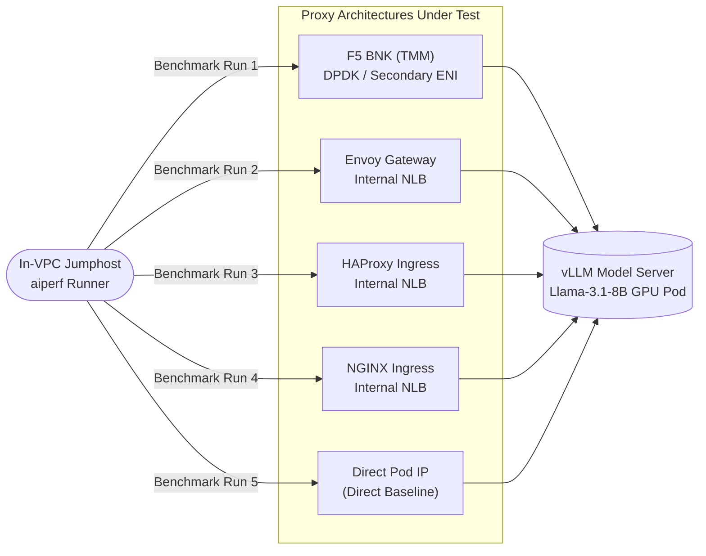

# AI Inference Benchmarking & Proxy Shootout Guide

`awsbnkctl` provides an enterprise-grade AI performance benchmarking engine tailored for **F5 BIG-IP Next for Kubernetes (BNK)**. It drives real-world and synthetic LLM inference workloads using NVIDIA's [`aiperf`](https://github.com/triton-inference-server/perf_analyzer) tool directly from an in-VPC test jumphost, measures critical GenAI metrics (TTFT, ITL, token throughput, and prefix cache hit rates), and pushes telemetry into [BNK Forge](https://github.com/f5devcentral/bnk-forge) for real-time visualization and multi-proxy shootout analysis.

---

## 1. Why Benchmark F5 BNK for AI?

Modern GenAI inference serving imposes unique demands on networking infrastructure:

- **Time to First Token (TTFT)**: High connection setup latency or proxy buffer bloat directly degrades conversational AI responsiveness.
- **Inter-Token Latency (ITL)**: Streaming Server-Sent Events (SSE) require zero packet jitter and high-efficiency TCP window management.
- **Prompt Prefix Caching**: Reusing common prompt prefixes (e.g., system instructions, few-shot examples) in vLLM / SGLang drastically cuts TTFT, provided the ingress layer supports intelligent request routing and sticky session affinity.
- **Line-Rate Throughput**: When serving multi-tenant LLM clusters across tens of concurrent users, traditional software proxies (Envoy, NGINX, HAProxy) often become CPU-bottlenecked by user-space context switches. F5 BNK TMM (Traffic Management Microkernel) uses dedicated secondary ENIs with DPDK/host-device acceleration to deliver predictable, microsecond-level proxy latencies.

`awsbnkctl` makes benchmarking push-button: zero manual `aiperf` script writing, zero public exposure of private endpoints, and automated multi-proxy comparative shootouts.

---

## 2. Benchmarking Architecture

Because F5 BNK's Gateway VIP lives on an isolated, non-routable secondary data-plane subnet (`BNK_EXT`, e.g. `10.0.10.0/24`), external workstations cannot hit the VIP directly. `awsbnkctl` solves this with a secure bidirectional architecture:

```mermaid
flowchart LR
    subgraph Operator["Operator Workstation"]
        direction TB
        UI["Forge Web UI (:3000)<br/>Dashboard & Sweeps"]
        Server["Forge Server (:8000)<br/>Dispatcher & Telemetry DB"]
        Daemon["awsbnkctl daemon<br/>Persistent Agent Listener"]
        UI --> Server
        Server <--> Daemon
    end

    subgraph VPC["AWS VPC Private Data Plane"]
        direction TB
        EICE["AWS EICE<br/>(IAM SSH Tunnel)"]
        JH["In-VPC Jumphost<br/>(aiperf Runner: 10.0.10.200)"]
        EICE --> JH
    end

    subgraph Ingress["F5 BNK Data Plane (Secondary ENI)"]
        direction TB
        VIP["Gateway VIP: 10.0.10.100:80<br/>(Host: awsbnkctl-aiinference.local)"]
        TMM["TMM Microkernel (DPDK)<br/>Prefix Routing & Rate Limiting"]
        VIP --> TMM
    end

    subgraph Serving["Inference Cluster (EKS)"]
        direction TB
        vLLM[("vLLM Model Serving<br/>Llama-3.1-8B GPU Pod")]
        EPP[("Prefill & Decode Endpoints<br/>Prometheus /metrics")]
    end

    Daemon -->|Secure Command Tunnel| EICE
    JH -->|L7 SSE Inference Stream| VIP
    TMM -->|Inference Forwarding| vLLM
    TMM -->|Disaggregated Routing| EPP
    Daemon -.->|Scrape Prometheus Metrics| EPP
```



### Architecture Highlights
1. **Workstation Daemon**: `awsbnkctl benchmark daemon` runs locally on the operator workstation and maintains a persistent WebSocket connection with 15-second heartbeats to Forge.
2. **Zero Inbound Cloud Exposure**: No public security group ingress is required. Commands are dispatched into the VPC using AWS EC2 Instance Connect Endpoint (EICE) ephemeral SSH tunnels authenticated by AWS IAM credentials.
3. **In-Network Driver**: The EC2 Jumphost attaches a secondary ENI (`10.0.10.200`) directly on the `BNK_EXT` subnet, generating high-concurrency traffic directly against the TMM Gateway VIP.
4. **Header Injection**: The runner automatically injects required Gateway API headers (`Host: awsbnkctl-aiinference.local`) to match Kubernetes `HTTPRoute` rules.
5. **Real-Time GenAI Scrapes**: Prometheus `/metrics` are scraped before and after each run to measure exact prefix-cache hit rates and KV-cache pool utilization.

---

## 3. Command Suite Reference

The `awsbnkctl benchmark` command family covers the full lifecycle of AI performance validation:

| Command | Primary Flags | Purpose |
|---|---|---|
| `benchmark setup` | `-f <cluster.yaml>`, `--preflight`, `--auto-discover` | Verifies `aiperf >= 0.10.0` on jumphost, registers SSH AccessMethod, BenchmarkAgent, and Target in Forge. |
| `benchmark daemon` | `-f <cluster.yaml>`, `--forge-agent-token`, `--heartbeat-interval` | Runs the persistent WebSocket listener to receive and execute dispatched benchmark tasks from Forge UI. |
| `benchmark run` | `-f <cluster.yaml>`, `--scenario`, `--scenarios`, `--proxies` | Executes a benchmark run directly via CLI (single run, smoke preset, native Forge scenario, or multi-proxy shootout). |
| `benchmark list` | *(none)* | Lists all available native Forge scenarios and built-in smoke presets. |
| `benchmark status` | `-f <cluster.yaml>`, `-w <workspace>` | Inspects jumphost readiness, `aiperf` version, Forge linkage, and discovered targets. |
| `benchmark ingest` | `<file.json>...`, `--expect-ttft-drop`, `--push` | Parses offline `aiperf` artifacts, verifies TTFT latency reductions, and pushes results to Forge. |

---

## 4. Built-in Smoke Presets (`--scenarios`)

For rapid health validation and quick sanity checks, `awsbnkctl` includes 4 built-in smoke presets accessible via the `--scenarios` flag:

```bash
# Run a single preset
awsbnkctl benchmark run -f cluster.yaml --scenarios latency

# Run multiple presets sequentially
awsbnkctl benchmark run -f cluster.yaml --scenarios latency,throughput,streaming

# Run all 4 presets
awsbnkctl benchmark run -f cluster.yaml --scenarios all
```

| Preset Name | Concurrency | Num Requests | ISL (Input Tokens) | OSL (Output Tokens) | Streaming | Primary Focus |
|---|:---:|:---:|:---:|:---:|:---:|---|
| `latency` | 1 | 50 | 512 | 128 | Yes | Baseline TTFT and single-stream latency without queuing. |
| `throughput` | 32 | 500 | 512 | 128 | No | Maximum sustained request and token throughput under heavy saturation. |
| `long-context` | 4 | 50 | 4096 | 512 | Yes | Memory bandwidth, KV cache expansion, and long-context decode performance. |
| `streaming` | 8 | 200 | 512 | 256 | Yes | Mid-load conversational streaming with Server-Sent Events (SSE). |

---

## 5. Native Forge Scenarios (`--scenario`)

For exhaustive performance benchmarking and characterization, `awsbnkctl` implements the full native Forge benchmark engine (WS-C1/WS-C2). Each scenario automatically expands into an ordered sequence of child runs (e.g. concurrency sweeps, multi-turn phases, or multi-round burst probes).

```bash
# Run the baseline concurrency sweep
awsbnkctl benchmark run -f cluster.yaml --scenario baseline

# Run prefix-cache evaluation followed by real-world Mooncake trace replay
awsbnkctl benchmark run -f cluster.yaml --scenario prefix-cache,mooncake
```

### Scenario Catalog

| Key | Scenario Name | Concurrency Sweep | ISL / OSL | Workload Pattern | Key Metric Validated |
|---|---|---|---|---|---|
| `baseline` | Baseline | 50, 100, 150, 200 | 500 / 128 | Synthetic chat completions; $rc = \max(c \times 5, 20)$. | TTFT and ITL curve across increasing concurrency. |
| `high-concurrency` | High Concurrency | 150, 200, 250, 300 | 5000–10000 / 128 | Heavy prompt pairs: (150, 5k), (200, 7k), (250, 9k), (300, 10k). | Proxy connection management under massive payload sizes. |
| `mixed-workload` | Mixed Workload | 50, 100, 150, 200 | Multi-phase | 3 phases: Warmup ($c=50$), Short (ISL 500), Long (ISL 600 with prefix prompts). | Dynamic queue scheduling and adaptation. |
| `multi-turn` | Multi-Turn | 50, 100, 150, 200 | 500 / 128 | 4 turns: Turn 1 (no prefix), Turns 2–4 with growing prefix length (500, 1000, 1500). | Chat session persistence and incremental prefix caching. |
| `prefix-cache` | Prefix Cache | 150, 200, 250, 300 | Heavy pairs | 80% shared prefix (length 4k–8k tokens) across 20 prompt pools. | KV-cache hit rate and TTFT drop on cached prompts. |
| `bimodal` | Bimodal Distribution | 50, 100, 150, 200 | Bimodal distribution | 70% short prompts (ISL 300 / OSL 64), 30% long prompts (ISL 4000 / OSL 256). | Head-of-line blocking prevention in proxy queues. |
| `sustained-load` | Sustained Load | 50, 100, 150, 200, 250 | 1500±300 / 128 | Endurance test: $rc = c \times 10$ (up to 2,500 requests per step). | Long-term memory stability and steady-state throughput. |
| `burst-recovery` | Burst Recovery | Alternating 200 / 25 | Bimodal / 256 | 5 consecutive rounds: Burst phase ($c=200, 400$ reqs) followed by Probe ($c=25, 50$ reqs). | Speed of latency recovery after sudden traffic spikes. |
| `mooncake` | Mooncake Trace | Open-loop trace | Production trace | Replay of KVCache Mooncake tool-agent production trace with 0.80x time-dilation. | Real-world production traffic resilience. |

> [!TIP]
> **Cold Cache Resets (`--reset-cache`)**: When running consecutive scenarios like `baseline,prefix-cache`, pass `--reset-cache` to trigger an automated cold-redeploy of the SageMaker/vLLM backend between scenario keys. This guarantees that KV-cache state does not bleed between runs.

---

## 6. Multi-Proxy Shootout Mode (`--proxies`)

The **Multi-Proxy Shootout** evaluates comparative performance by running identical synthetic or trace workloads against F5 BNK and alternative ingress architectures deployed side-by-side in the same cluster:



### Running a Shootout
```bash
awsbnkctl benchmark run -f cluster.yaml \
  --proxies f5-bnk,envoy,haproxy,nodeport \
  --scenario baseline \
  --model meta-llama/Llama-3.1-8B-Instruct
```

### How Shootout Works
1. When `--proxies` includes non-BNK proxies (e.g. `envoy`, `haproxy`), `awsbnkctl` tags the Forge `BenchmarkTarget` with `proxy_expose=internal-nlb` and points to the target Kubernetes Service.
2. The benchmark engine executes the scenario sweep against each proxy front-end in sequence.
3. With `--direct-pod-ip <IP>`, an un-proxied `nodeport` baseline run is included to isolate proxy overhead from raw inference execution.
4. Results are tagged by proxy type (`proxy=f5-bnk`, `proxy=envoy`, etc.) and rendered side-by-side in Forge's comparative analytics view.

---

## 7. GenAI Metrics & Prometheus Scraping

Beyond standard HTTP response codes and raw round-trip latency, `awsbnkctl` captures deep GenAI inference telemetry:

| Metric | Description | Source |
|---|---|---|
| `ttft_p50_ms` / `p90` / `p95` / `p99` | Time to First Token percentiles (ms). | `aiperf` streaming timestamps |
| `itl_p50_ms` / `p95` / `p99` | Inter-Token Latency percentiles (ms per token chunk). | `aiperf` SSE chunk delta |
| `output_tokens_per_sec` | Total output tokens delivered divided by elapsed duration. | `aiperf` output token count |
| `prefix_cache_hit_rate` | Ratio of prompt tokens serviced from GPU KV memory cache (0.0 to 1.0). | Scraped Prometheus delta |
| `prefill_worker_utilization` | Average GPU KV memory cache allocated on prefill workers. | Scraped Prometheus gauge |
| `decode_worker_utilization` | Average GPU KV memory cache allocated on decode workers. | Scraped Prometheus gauge |

### Configuring Prometheus Scrapes
```bash
# Scrape vLLM pods through Kubernetes API pod proxy
awsbnkctl benchmark run -f cluster.yaml --scenario prefix-cache \
  --metrics-pod-selector app=vllm \
  --metrics-namespace default \
  --metrics-port 8000 \
  --genai-out /tmp/genai-results.json

# Scrape disaggregated prefill/decode endpoints via Jumphost curl
awsbnkctl benchmark run -f cluster.yaml --scenario prefix-cache \
  --metrics-url prefill=http://10.0.20.11:8000/metrics \
  --metrics-url decode=http://10.0.20.12:8000/metrics
```

---

## 8. Offline Analysis & Regression Gate (`benchmark ingest`)

The `benchmark ingest` tool parses offline `aiperf` raw JSON artifacts and `--genai-out` files without requiring an active cluster. It allows CI pipelines to enforce performance regression gates using `--expect-ttft-drop`:

```bash
# Compare a cold baseline run against a prefix-cached run and assert >= 30% TTFT reduction
awsbnkctl benchmark ingest baseline.json prefix-cached.json --expect-ttft-drop 30.0
```

### Sample Output
```text
LABEL           TTFT p50  TTFT p95  TTFT p99  ITL p50  ITL p99  IN tok/s  OUT tok/s  PREFIX HIT  RUN
baseline        185.4     240.1     295.0     12.10    19.40    1420.0    480.0      0.0%        -
prefix-cached   42.1      65.8      92.4      11.80    18.90    4950.0    510.0      84.2%       -

TTFT p50 prefix-cached vs baseline: -77.3%
✓ TTFT expectation met (77.3% drop >= 30.0%)
```

---

## 9. Synthetic Mode (`--synthetic`) for CI/CD

To test benchmark pipelines, Forge linkages, and dashboard reporting without provisioning expensive GPU instances:

```bash
awsbnkctl benchmark run -f cluster.yaml --synthetic --scenario baseline
```

In synthetic mode, `awsbnkctl` simulates a realistic vLLM `Llama-3-8B` inference endpoint (`llm-d-inference-sim`), generating complete TTFT, ITL, and token throughput telemetry while running entirely on low-cost CPU instances.

---

## 10. Step-by-Step Operator Runbook

### Scenario A: Operator Web UI Driven Session
1. **Pre-stage Jumphost**:
   ```bash
   awsbnkctl benchmark setup -f cluster.yaml --forge-user admin --forge-pass changeme
   ```
2. **Start Daemon on Workstation**:
   ```bash
   awsbnkctl benchmark daemon -f cluster.yaml --forge-user admin --forge-pass changeme
   ```
3. Open `http://localhost:3000` (Forge Web UI), navigate to **Benchmarks** → **Run Benchmark**, select the Jumphost Agent, choose `prefix-cache`, and click **Start**.

### Scenario B: Fully Automated CLI Sweep for Comparative Benchmarks
```bash
# 1. Verify environment
awsbnkctl benchmark status -f cluster.yaml

# 2. Run head-to-head proxy shootout
awsbnkctl benchmark run -f cluster.yaml \
  --proxies f5-bnk,envoy,haproxy \
  --scenario baseline,prefix-cache \
  --run-label proxy-shootout \
  --genai-out /tmp/shootout.json
```
