# Scenarios & Demos Catalogue for awsbnkctl

This document provides a comprehensive, diagram-rich breakdown of all **15 automated validation scenarios** and **5 curated demonstration walkthroughs** (including the **AgentCore AI Gateway demo**) built into `awsbnkctl`.

Scenarios validate live data-plane traffic, protocol handshakes, and security policies against the provisioned EKS cluster and F5 BIG-IP Next for Kubernetes (BNK) TMM interfaces. They run from the in-VPC EC2 jumphost via an ephemeral AWS EC2 Instance Connect (EICE) tunnel, providing end-to-end assurance directly inside the isolated VPC data plane.

---

## Running Scenarios & Demos

```bash
# List all registered scenarios and their rating (Green / Amber)
awsbnkctl scenarios list

# Run a specific scenario against your cluster
awsbnkctl scenarios run <scenario-name> -f my-cluster.yaml

# Run all 15 scenarios sequentially
awsbnkctl scenarios run --all -f my-cluster.yaml

# Clean up scenario-specific test fixtures and namespaces
awsbnkctl scenarios clean <scenario-name> -f my-cluster.yaml

# List and run curated live demos
awsbnkctl demo list
awsbnkctl demo run <demo-name> -f my-cluster.yaml
```

---

## 1. Ingress & L7 Protocol Scenarios

### `http-routing-e2e` (VIP `.100`)
- **Objective**: Validates standard Kubernetes Gateway API `Gateway` + `HTTPRoute` routing.
- **Traffic Path**: Client (EC2 jumphost via EICE tunnel) $\to$ TMM VIP (`<subnet>.100`) $\to$ `http-echo` backend pods.
- **Provisions**: `Gateway` referencing `GatewaySettings`, `HTTPRoute` matching path `/`, Deployment `http-echo`.
- **Assertions**: 5/5 jumphost curls return HTTP 200 through the VIP.
- **Rating**: **Green**.

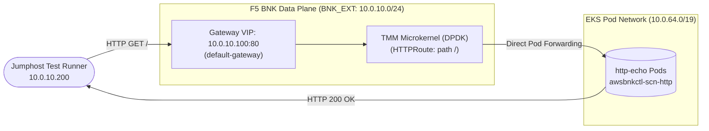

---

### `http-traffic-split` (VIP `.101`)
- **Objective**: Validates weighted canary traffic distribution across multiple backend deployments.
- **Traffic Path**: Jumphost $\to$ TMM VIP (`<subnet>.101`) $\to$ `backend-a` (70%) vs `backend-b` (30%).
- **Provisions**: `Gateway`, `HTTPRoute` with weighted `backendRefs` (70/30), Deployments `backend-a` and `backend-b`.
- **Assertions**: Both `backend-a` and `backend-b` appear across 10 jumphost curls.
- **Rating**: **Green**.

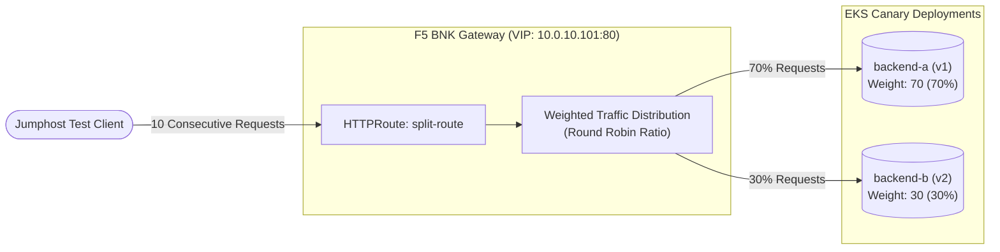

---

### `grpc-loadbalance` (VIP `.108`)
- **Objective**: Validates gRPC stream handling and balancing across microservices.
- **Traffic Path**: Client $\to$ TMM VIP (`<subnet>.108`, `L4Route` TCP data plane; `GRPCRoute` on the control plane) $\to$ `kong/grpcbin` backend pods.
- **Assertions**: Control plane validation — `grpcbin` Deployment Available, both Gateways Programmed, `GRPCRoute` and `L4Route` Accepted.
- **Rating**: **Amber** (control plane only; live data-path probe requires `grpcurl` on the jumphost driving VIP:50052 and asserting status `OK`).

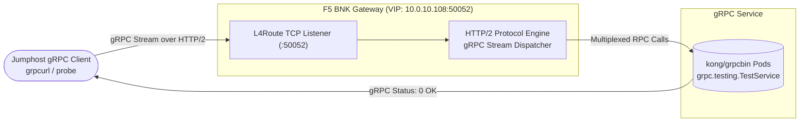

---

## 2. L4 Protocol & Transport Scenarios

### `tcp-l4-loadbalance` (VIP `.106`)
- **Objective**: Validates raw L4 TCP stream proxying via `L4Route`.
- **Traffic Path**: Jumphost curl $\to$ `L4Route` on VIP:8080 (`<subnet>.106`) $\to$ two nginx marker backends.
- **Assertions**: Deployments Available, Gateway Programmed, `L4Route` Accepted, both weighted backends reached.
- **Rating**: **Green**.

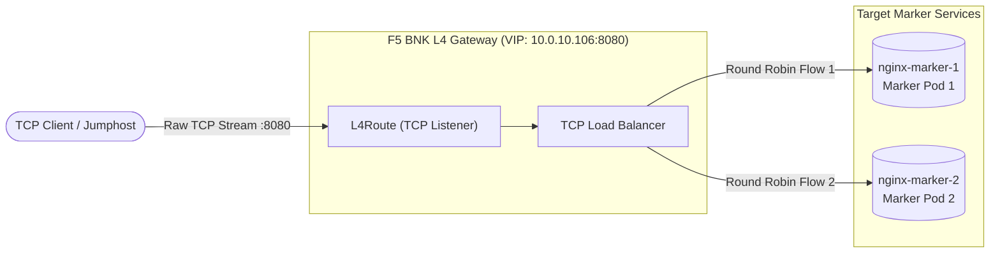

---

### `udp-l4-loadbalance` (VIP `.107`)
- **Objective**: Validates stateless UDP datagram routing and load distribution.
- **Traffic Path**: UDP client $\to$ TMM L4 VIP:5353 (`<subnet>.107`) $\to$ UDP echo servers.
- **Assertions**: Control plane — `udp-echo` Deployment Available, Gateway Programmed, `L4Route` Accepted.
- **Rating**: **Amber** (control plane only; green requires `socat`/`nc` on the jumphost driving VIP:5353).

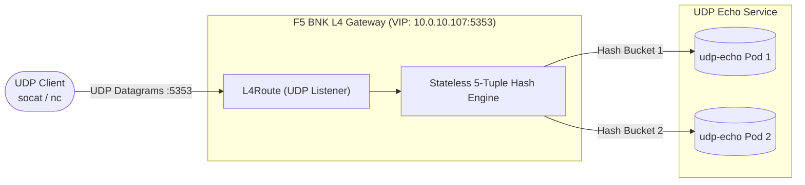

---

### `proxy-protocol-l4` (VIP `.103`)
- **Objective**: Validates PROXY protocol v1 header injection via an `F5BigCneIrule` + `NetPolicy` on the TCP listener.
- **Traffic Path**: Client sending traffic $\to$ TMM VIP (`<subnet>.103`) $\to$ Backend pod.
- **Assertions**: The backend echoes `$proxy_protocol_addr`; it must match the jumphost `BNK_EXT` ENI IP (`<subnet>.200`).
- **Rating**: **Green**.

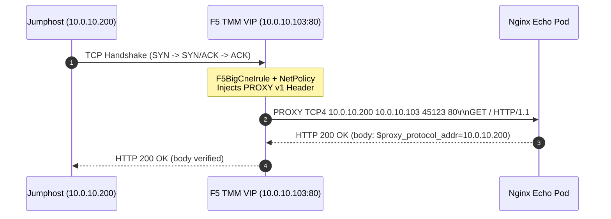

---

## 3. Hybrid & Multi-Tenancy Scenarios

### `external-resource-pool` (VIP `.102`)
- **Objective**: Validates BNK routing traffic to external endpoints located outside the Kubernetes cluster (e.g., bare-metal VMs or AWS RDS/ALB).
- **Traffic Path**: Jumphost $\to$ TMM VIP (`<subnet>.102`) $\to$ External IP targets outside EKS pod CIDR.
- **Assertions**: Successful response proxying from non-cluster IP pools.
- **Rating**: **Green**.

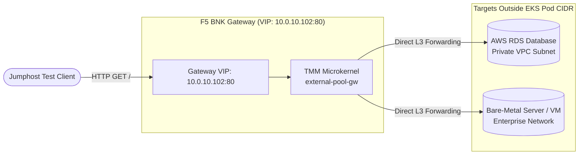

---

### `cluster-wide-watch` (CWC) (VIP `.105`)
- **Objective**: Validates `ClusterWideWatch` CR for multi-tenant cross-namespace routing without full cluster admin permissions.
- **Traffic Path**: Tenant client $\to$ TMM VIP (`<subnet>.105`) $\to$ backend in a namespace created after BNK was installed.
- **Assertions**: The new namespace's Deployment becomes Available, its Gateway is Programmed and HTTPRoute Accepted. Jumphost curls VIP with `Host: cwatch.awsbnkctl.local`; every probe must return HTTP 200.
- **Rating**: **Green**.

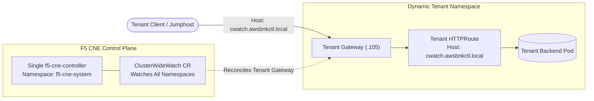

---

### `cwc-admin-access` (In-Cluster)
- **Objective**: Validates that CWC admin and licensing endpoints require both a client certificate and a Bearer token.
- **Traffic Path**: In-cluster probe Deployment $\to$ CWC HTTPS endpoints.
- **Assertions**: Authenticated request accepted; missing token rejected; bogus token rejected.
- **Rating**: **Green**.

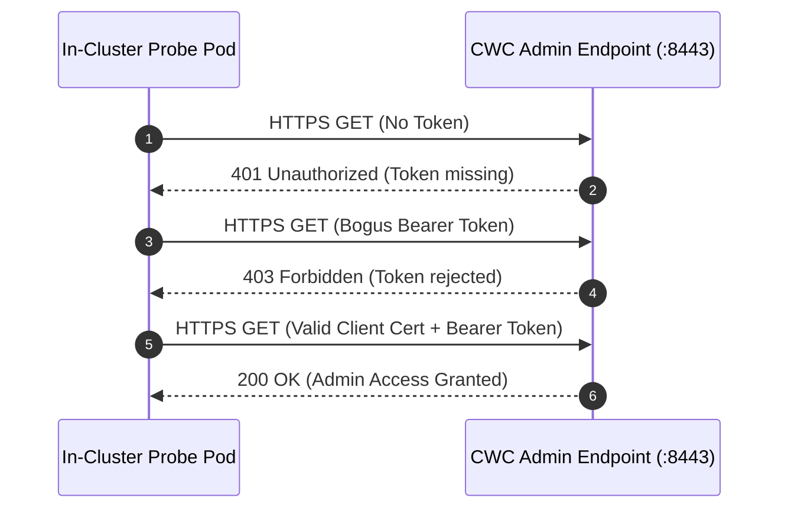

---

### `multi-vip` (VIPs `.115`, `.116`, `.117`)
- **Objective**: Validates binding and processing traffic across multiple distinct VIPs on the same secondary ENI.
- **Traffic Path**: Simultaneous curls to VIP 1 (`<subnet>.115`, App A) and VIP 2 (`<subnet>.116`, App B).
- **Assertions**: Complete isolation and correct service responses for each VIP.
- **Rating**: **Green**.

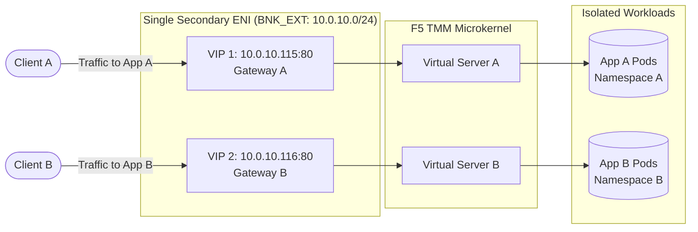

---

## 4. AI Gateway Scenarios

### `ai-token-counting` (VIP `.104`)
- **Objective**: Validates AI Gateway LLM token measurement, quota enforcement, and rate-limiting.
- **Traffic Path**: Client HTTP POST with chat completions payload $\to$ TMM AI Gateway (`<subnet>.104`) $\to$ Model endpoint.
- **Assertions**: Control plane always — backend Deployment Available, Gateway Programmed, HTTPRoute Accepted, annotation `k8s.f5.com/ai-token-counting` persists. Live vLLM data path asserts token metering and HTTP 503 on overload.
- **Rating**: **Amber** (control plane only unless live vLLM backend is pointed at; full data path on `demo-ai`).

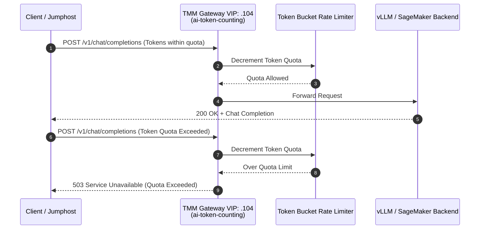

---

### `ai-semantic-cache` (VIP `.109`)
- **Objective**: Validates semantic similarity prompt caching to reduce LLM latency and compute costs.
- **Traffic Path**: Initial prompt POST $\to$ Cache miss (backend computed); Second similar prompt POST $\to$ Cache hit (TMM cached response).
- **Assertions**: Control plane always — Gateway Programmed, HTTPRoute Accepted, annotations `k8s.f5.com/ai` and `k8s.f5.com/sse-enabled` persist. When ModelCache backend is present, both return HTTP 200 with SSE framing and the second is faster by at least the configured threshold (default 100 ms).
- **Rating**: **Amber** (control plane only unless a ModelCache backend is pointed at).

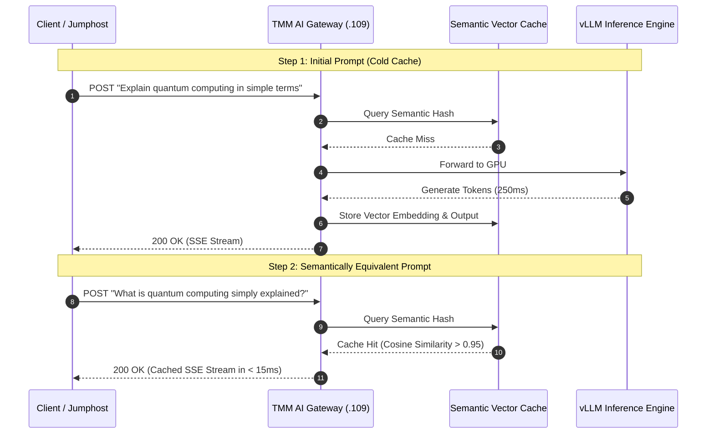

---

### `ai-inference-e2e` (VIP `.112`)
- **Objective**: Validates end-to-end LLM inference through BNK: a vLLM Deployment serving `Llama-3-8B-Instruct` on the GPU node group (requires a `gpu: true` node group and an `hf-token` Secret for the gated model).
- **Traffic Path**: Jumphost `POST /v1/chat/completions` with `stream=true` $\to$ TMM VIP (`<subnet>.112`, `Gateway` + `HTTPRoute`) $\to$ vLLM pods on GPU nodes.
- **Assertions**: vLLM Deployment Available, Gateway Programmed, HTTPRoute Accepted, then HTTP 200 with SSE framing (`data:` chunks and `[DONE]` terminator) via the VIP.
- **Synthetic mode** (`ai.synthetic` or `--synthetic`): `llm-d-inference-sim` pods stand in for vLLM. Each pod tokenizes with the real model tokenizer (a `vllm-render` sidecar), serves the profile's Hugging Face id (`llama3` is an alias), and publishes KV-cache events like vLLM: per pod on port 20080, replay on 20081. Endpoint pickers (the F5 EPP, llm-d) connect to each pod as they would to vLLM. For agentic benchmarks with long shared contexts, set `maxNumSeqs` to what the KV cache holds per request (for the 70B profile and 17k-token requests, `maxNumSeqs: 40`) and `timeFactorUnderLoad: 3`, so a busy replica slows down the way a real one does.
- **Rating**: **Green** on `demo-ai` (real GPU) or with `--synthetic`.

```mermaid
flowchart LR
    Client([Jumphost Test Client<br/>aiperf Engine])

    subgraph Gateway["F5 BNK AI Gateway (VIP: 10.0.10.112:80)"]
        direction TB
        VIP["Gateway VIP: 10.0.10.112:80<br/>Host: awsbnkctl-aiinference.local"]
        TMM["TMM Microkernel<br/>HTTPRoute: scn-aiinference-route"]
        VIP --> TMM
    end

    subgraph InferenceNodes["Inference Worker Group"]
        Model[("vLLM / Simulator<br/>meta-llama/Llama-3-8B-Instruct")]
    end

    Client -->|POST /v1/chat/completions (stream=true)| VIP
    TMM -->|Balanced Inference Stream| Model
    Model -->|SSE Stream: data: {...}| Client
```

*(For comprehensive benchmarking, multi-proxy shootouts, and TTFT latency analysis, see [`docs/BENCHMARKS.md`](BENCHMARKS.md).)*

---

## 5. Security & Diagnostics Scenarios

### `egress-snat`
- **Objective**: Validates outbound Source NAT (SNAT) and egress firewall inspection.
- **Traffic Path**: Pod $\to$ Node $\to$ VXLAN over the pod network to TMM (`ext-vlan-infra` on single-interface patterns, `int-vlan-infra` on dual-interface) $\to$ AUTOMAP SNAT to the external self-IP $\to$ `ext-vlan-infra` $\to$ NAT gateway $\to$ external destination. Intra-VPC traffic stays on the node.
- **Provisions**: Client pod, `GatewaySettings` with `egressConfigs` (`default-egress`, Automap), and `EgressGateway` selecting the namespace.
- **Assertions**: Client pod Ready; `GatewaySettings` Accepted and ResolvedRefs; `EgressGateway` Programmed; 3 curls from pod to an out-of-VPC URL must raise TMM's egress virtual-server connections and SNAT connections by 3 (read via `tmctl`).
- **Rating**: **Green**.

```mermaid
flowchart LR
    subgraph Pods["EKS Worker Node Pod Network"]
        ClientPod[("Workload Pod<br/>(Selected Namespace)")]
        Router["Node Routing Policy"]
        ClientPod --> Router
    end

    subgraph BNK["F5 BNK Data Plane (TMM)"]
        Tunnel["VXLAN Tunnel Interface<br/>(ext-vlan-infra / int-vlan-infra)"]
        SNAT["EgressGateway & AUTOMAP<br/>SNAT Engine"]
        SelfIP["External Self-IP<br/>(10.0.10.224 - .254)"]
        Tunnel --> SNAT --> SelfIP
    end

    subgraph Egress["AWS Network Egress"]
        NAT["AWS NAT Gateway"]
        Internet([External SaaS API / Registry])
        NAT --> Internet
    end

    Router -->|Out-of-VPC Egress Traffic| Tunnel
    Router -.->|Intra-VPC Traffic (Bypasses TMM)| LocalVPC[("Local VPC Resources")]
    SelfIP --> NAT
```

---

### `core-file-collection`
- **Objective**: Validates BNK's core-dump collection infrastructure: enabling `spec.coreCollection.enabled` on the `CNEInstance` causes FLO to reconcile `CoreMond` and mount host crash directories into TMM pods.
- **Verification Method**: Kubernetes API inspection polled for up to 5 minutes: `CoreMond` CR exists, `f5-coremond` DaemonSet is Ready, CNEInstance reports `CoreMon*` condition True, and `f5-tmm` DaemonSet carries crash volume mounts.
- **Assertions**: Proves collection path is wired without inducing an artificial crash.
- **Note**: Run this scenario **last** because FLO rolling TMM to add crash mounts briefly restarts the data plane.
- **Rating**: **Green**.

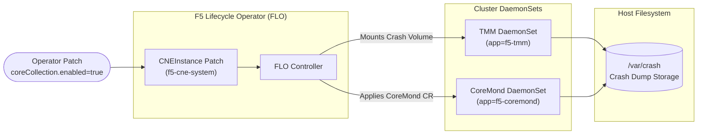

---

## 6. Curated Demonstrations & Walkthroughs

In addition to automated tests, `awsbnkctl` includes 5 turnkey demonstrations with live narrations and telemetry:

### `agentcore-demo` — AI Agent Tool Call Governance (VIP `.150`)
- **Objective**: Demonstrates governing generative AI agent tool calls using F5 BNK. An **Amazon Bedrock AgentCore** agent making Model Context Protocol (MCP) tool calls is authenticated, rate-limited, firewall-checked, and logged in real-time.
- **Location**: `examples/agentcore-demo/`
- **Traffic Path**: Bedrock AgentCore Agent $\to$ Private Route 53 (`bnk-ingress.bnk-demo.internal`) $\to$ BNK Gateway VIP (`10.0.10.150:80/443`) $\to$ MCP Finance Tool Pod (`forecast`, `get_account_balance`).

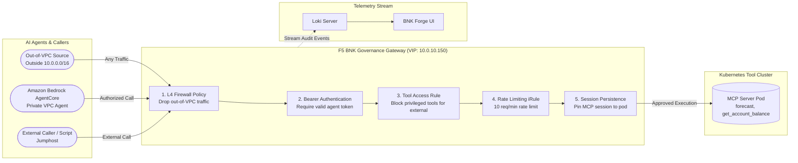

---

### `diameter` Demo (VIP `.110`)
- **Objective**: Demonstrates carrier-grade telecom Diameter protocol (RFC 6733) L4 proxying over TCP.
- **Traffic Path**: Jumphost Python client (`diameter_client.py`) $\to$ TMM L4 Gateway VIP:3868 (`<subnet>.110`) $\to$ `diameter-responder` pod.
- **Validation**: Completes full Capabilities Exchange Request (CER) $\to$ Capabilities Exchange Answer (CEA) handshake and asserts `Result-Code=2001 (DIAMETER_SUCCESS)`.

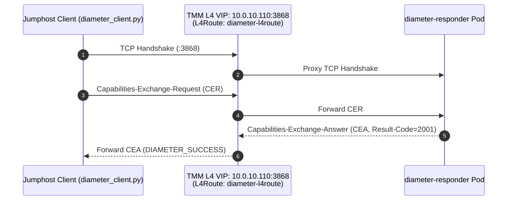

---

### `http2` Demo (VIP `.111`)
- **Objective**: Demonstrates end-to-end HTTP/2 multiplexing (h2c) with prior knowledge.
- **Traffic Path**: Jumphost `curl --http2-prior-knowledge` $\to$ TMM VIP (`<subnet>.111`) $\to$ `h2c-backend` pod (`appProtocol: kubernetes.io/h2c`).
- **Validation**: 5/5 requests return HTTP 200 with wire-level HTTP/2 framing and backend marker confirmation.

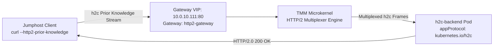

---

### `bigip-cis` Demo (VIP `.120`)
- **Objective**: Demonstrates the traditional ingress pattern (in-cluster CIS controller + external BIG-IP Virtual Edition appliance) in contrast to BNK's modern in-cluster TMM Gateway API.
- **Traffic Path**: Client $\to$ External BIG-IP VE VIP (`10.0.10.120`) $\to$ Shared `whoami` backend pods.
- **Validation**: CIS reconciles `VirtualServer` CRD and routes traffic through the external BIG-IP appliance.

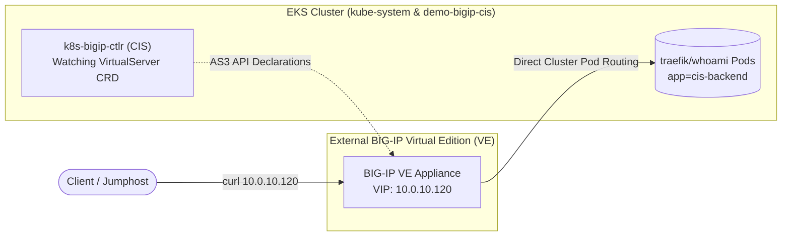

---

### `ingress-migration` Demo (VIP `.113`)
- **Objective**: Demonstrates zero-downtime migration to BNK Gateway API by running three ingress controllers simultaneously in front of ONE shared `whoami` backend.
- **Traffic Path**: Jumphost curls each ingress path using distinct host headers:
  - BNK Gateway (`web.bnk.migration.local` on VIP `10.0.10.113`)
  - NGINX Ingress (`web.nginx.migration.local` on ClusterIP)
  - HAProxy Ingress (`web.haproxy.migration.local` on ClusterIP)
- **Validation**: All 3 paths return HTTP 200 with the backend `Hostname` marker, proving seamless side-by-side migration.

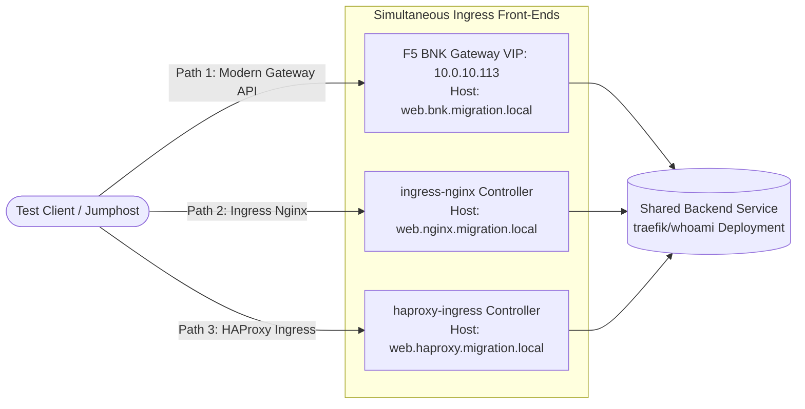

---

## 7. Where Each Scenario & Demo Runs

Every deployable example under `examples/` enables the test jumphost, so all 15 scenarios and demos can be run across configurations:

| Scenario / Demo | Needs Jumphost | Needs GPU Node | Prerequisites / Notes | Runs On |
|---|:---:|:---:|---|---|
| `http-routing-e2e` | Yes | – | Owns default cluster VIP (`.100`) | All examples |
| `http-traffic-split` | Yes | – | Owns VIP `.101` | All examples |
| `external-resource-pool` | Yes | – | Uses jumphost as external backend (VIP `.102`) | All examples |
| `proxy-protocol-l4` | Yes | – | Owns VIP `.103` | All examples |
| `tcp-l4-loadbalance` | Yes | – | Owns VIP `.106` | All examples |
| `udp-l4-loadbalance` | – | – | Amber: control plane only (VIP `.107`) | All examples |
| `grpc-loadbalance` | – | – | Amber: control plane only (VIP `.108`) | All examples |
| `multi-vip` | Yes | – | Pool `.115`–`.117` | All examples |
| `cluster-wide-watch` | Yes | – | Dynamic tenant namespace (VIP `.105`) | All examples |
| `cwc-admin-access` | – | – | In-cluster probe (no VIP) | All examples |
| `ai-token-counting` | – | – | Amber: control plane only without vLLM (VIP `.104`) | All examples; data path on `demo-ai` |
| `ai-semantic-cache` | (probe) | – | Amber: control plane only without ModelCache (VIP `.109`) | All examples |
| `ai-inference-e2e` | Yes | **Yes** | `HF_TOKEN` for gated model; `--synthetic` runs on CPU | `demo-ai` (real); others with `--synthetic` |
| `egress-snat` | (proof) | – | Tunnel VLAN matches pattern; data path proven via `tmctl` | All examples; real on dual-interface |
| `core-file-collection` | – | – | Rolls TMM pods; run **last** (no VIP) | All examples |
| `agentcore-demo` | Yes | – | Bedrock AgentCore runtime + MCP finance tool (VIP `.150`) | `examples/agentcore-demo` |
| `diameter` | Yes | – | Demo mode; Diameter CER/CEA handshake (VIP `.110`) | `demo.enabled: true` |
| `http2` | Yes | – | Demo mode; h2c wire multiplexing (VIP `.111`) | `demo.enabled: true` |
| `bigip-cis` | Yes | – | Needs `bigipVE:` block provisioned (VIP `.120`) | `full-cluster` with BIG-IP VE |
| `ingress-migration` | Yes | – | Demo mode; installs Nginx & HAProxy controllers (VIP `.113`) | `demo.enabled: true` |

---

## 8. VIP Address Allocation Plan

Every scenario and demo owns one deterministic last octet in the external data-path subnet (`network.dataPath.external.cidr`, `10.0.10.0/24` in all examples):

| Last Octet | Allocated Address | Owner | Kind |
|:---:|---|---|---|
| `.100` | `10.0.10.100` | `http-routing-e2e` (cluster default) | Scenario |
| `.101` | `10.0.10.101` | `http-traffic-split` | Scenario |
| `.102` | `10.0.10.102` | `external-resource-pool` | Scenario |
| `.103` | `10.0.10.103` | `proxy-protocol-l4` | Scenario |
| `.104` | `10.0.10.104` | `ai-token-counting` | Scenario |
| `.105` | `10.0.10.105` | `cluster-wide-watch` (CWC) | Scenario |
| `.106` | `10.0.10.106` | `tcp-l4-loadbalance` | Scenario |
| `.107` | `10.0.10.107` | `udp-l4-loadbalance` | Scenario |
| `.108` | `10.0.10.108` | `grpc-loadbalance` | Scenario |
| `.109` | `10.0.10.109` | `ai-semantic-cache` | Scenario |
| `.110` | `10.0.10.110` | `diameter` | Demo |
| `.111` | `10.0.10.111` | `http2` | Demo |
| `.112` | `10.0.10.112` | `ai-inference-e2e` | Scenario |
| `.113` | `10.0.10.113` | `ingress-migration` | Demo |
| `.115`–`.117` | `10.0.10.115`–`.117` | `multi-vip` (VIP A `.115`, VIP B `.116`, pool end `.117`) | Scenario |
| `.120` | `10.0.10.120` | `bigip-cis` (BIG-IP VE virtual server) | Demo |
| `.121`–`.123` | `10.0.10.121`–`.123` | `local-zone` reference manifests (SCTP, Diameter, HTTP/2) | Example |
| `.130` | `10.0.10.130` | `demo-ai` proxy shootout | Example |
| `.150` | `10.0.10.150` | `agentcore-demo` Gateway (`gateway-deployment.yaml`) | Example / Demo |
| `.200` | `10.0.10.200` | Jumphost External ENI (Phase 17b) | Infrastructure |
| `.224`–`.254` | `10.0.10.224`–`.254` | TMM External Self-IP Pool (/27 allocated via F5 IPAM controller) | Infrastructure |

> [!NOTE]
> `cwc-admin-access`, `core-file-collection`, and `egress-snat` do not allocate external VIPs.
