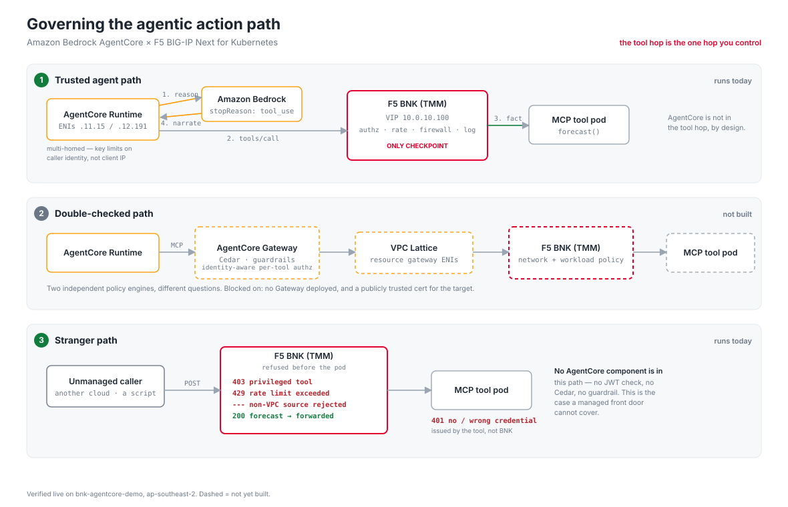
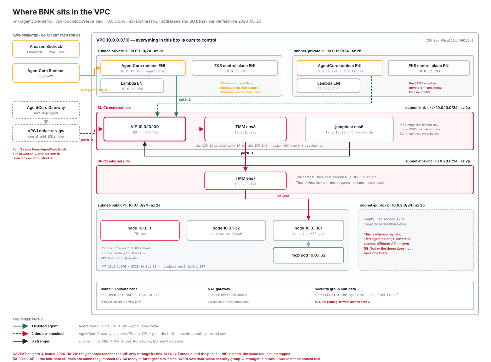
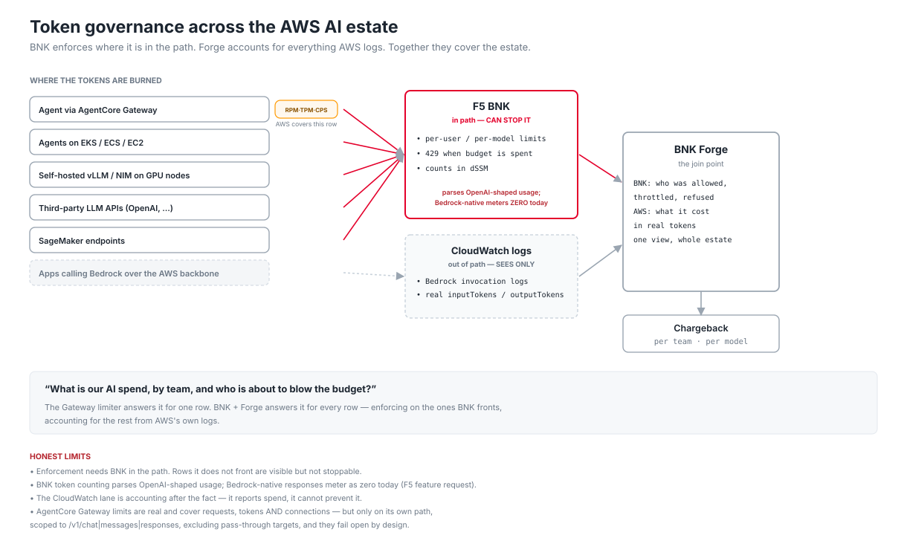

# Architecture: AgentCore and BNK together

This is the reasoning behind [the demo](../README.md). It answers three
questions: why a tool call is the hop worth governing, who can reach the tool
and what polices each of them, and what AWS and F5 each contribute.

## Why a tool call exists

The model does not know the answer. Ask the agent to forecast NFLX and Bedrock's
first response is not prose, it is a request:

```json
"text":    "Sure! Let me fetch the latest forecast for Netflix (NFLX)."
"toolUse": { "name": "forecast", "input": {"symbol": "NFLX"} }
"stopReason": "tool_use"
```

The runtime executes that call, through BNK, and gets back a number the MCP pod
generated a second earlier. Only then does Bedrock write prose that quotes it.
Bedrock supplies reasoning and language; the tool supplies facts. Bedrock is
called twice per request, once to decide and once to narrate, and the tool hop
sits between the two. Whoever controls that hop controls the agent's reach.

## Two things called "Gateway"

- The **BNK Gateway** is the Kubernetes Gateway API resource in
  `gateway-deployment.yaml`. It is deployed and carries every path below.
- The **AgentCore Gateway** is an Amazon Bedrock AgentCore service that fronts
  MCP tools with Cedar authorization and guardrails. It is *not* deployed in this
  account. That is the only reason the double-checked path below is marked not
  deployed; nothing on the BNK side is missing.

## The three paths



| Path | Who calls | Governed by | Status |
| --- | --- | --- | --- |
| 1. Trusted agent | our AgentCore runtime, VPC-mode ENIs in our subnets | BNK only | runs today |
| 2. Double-checked | the same agent, via an AgentCore Gateway | AgentCore Gateway **and** BNK | not deployed |
| 3. Stranger | anything else: another cloud, a script, a compromised workload | BNK only | runs today |

**Path 1.** The agent resolves `bnk-ingress.bnk-demo.internal` through a private
Route 53 zone to the BNK VIP and calls the tool. BNK routes, rate-limits per
caller identity and logs. AWS never inspects this hop; to AgentCore the agent
made an ordinary outbound HTTP call.

**Path 2.** The agent's call goes to an AgentCore Gateway first. The Gateway
knows which principal is asking for which tool and applies Cedar per-tool
authorization and guardrails before anything reaches the network. BNK then
applies network policy to the forwarded traffic. Two independent checks asking
different questions. The value is separation of duties: a BNK misconfiguration
alone does not open the tool, and vice versa. What it takes to build is in
[`ROADMAP.md`](ROADMAP.md).

**Path 3.** A caller that never touched AWS. No JWT, no Cedar, no guardrail,
because none of those components are in the path. BNK is the only thing between
the caller and the tool. AgentCore structurally cannot help here, which is why
the two products are complementary.



Regenerate both diagrams with `python3 scripts/build-diagram.py`. Subnet CIDRs
are stable; ENI and pod addresses are read off the live cluster and change on a
rebuild.

## What BNK enforces on the data path

| Control | Behaviour | Status |
| --- | --- | --- |
| TLS termination on 443 with a cert from the in-cluster CA | encrypted transport | on |
| Rate limit, 10 per 60 s, keyed on caller identity from the bearer token | `429` with a JSON-RPC error and `Retry-After: 60` | on |
| Privileged-tool gate | `get_account_balance` needs the agent token; `403` before the pod | on |
| L4 firewall | accept `10.0.0.0/16`, reset everything else | on |
| MCP payload capture | request and response bodies in the log record | on |
| JWT validation, OAuth, access policy | `F5BigAccessJwtConfig` and 24 other identity CRDs are installed | available |
| L4 DDoS vectors | `F5BigDdosGlobal` | available |

The rate limit is keyed on identity, not IP, because the runtime is multi-homed
across both agent subnets; an IP-keyed bucket would give one caller a fresh
budget per ENI. Unauthenticated callers fall back to `ip:<addr>`. The token is
never logged; records carry the resolved label (`agent`, `external`,
`anonymous`) and the source address.

Token counting is deliberately off on this Gateway. It is Gateway-scoped and
requires an LLM `model` field in every request body, which would break all MCP
traffic, and the only LLM leg here (runtime to Bedrock) never crosses BNK.
The annotation block is kept, commented out, in `gateway-deployment.yaml`.

## Observability

```
  caller ──► BNK (TMM)  iRule: HTTP_REQUEST  → allow or 429, one JSON line
                        HTTP_RESPONSE → status, latency
             │ f5-fluentbit sidecar stdout
             ▼
  bnkgov-collector DaemonSet (llm-egress)  tail, grep BNKGOV, parse
             ▼
  loki.llm-egress:3100   job="llm-gateway", labels model / status
             ▼
  BNK Forge → LLM Observability
```

The namespace, service name and port are load-bearing: Forge queries
`http://loki.llm-egress:3100` for streams labelled `job="llm-gateway"`. Forge
only renders an iRule attachment when the `NetPolicy` names a listener via
`sectionName`, which is why the demo ships one policy per listener.

BNK's token columns are zero, honestly: it never sees the model call. Bedrock's
model-invocation logs do, and `mcp-bedrock-token-shipper.yaml` copies them into
the same Loki stream so Forge shows the governance view and the cost view side
by side. In one `agentcore invoke`, `mcp:finance-tool` shows the calls and
throttles; `global.anthropic.claude-sonnet-4-6` shows the tokens they cost.



## What each side brings

This is an AND, not a comparison.

**AgentCore** gives you a managed runtime, managed model access and, where a
Gateway is in the path, identity-aware per-tool authorization in Cedar,
guardrails and MCP-to-HTTP translation. Real authorization semantics, operated
by AWS, that you do not have to build. It also ships token-per-minute rate
limiting on the Gateway, for traffic through that Gateway.

**BNK** sits in the cluster and is in the path for everything that reaches the
workloads:

1. Reach beyond the managed path: Path 3 traffic that no managed front door sees.
2. One policy surface across agent estates: the same config governs an
   AgentCore agent, a self-hosted agent and a third party's caller.
3. Protection of the workload itself: DDoS vectors, per-source rate and
   connection limits beside the pods.
4. Consolidation where you want it: JWT, OAuth and access policy as CRDs, for
   teams that prefer authorization at the network edge.
5. Unified evidence: one telemetry stream covering every path, joined with
   Bedrock's token records.

Two limits, stated plainly. Enforcement needs BNK in the path; what it does not
front is visible via the shipper but not stoppable. And BNK's token counting
parses OpenAI-shaped `usage`, so a Bedrock-native response meters as zero.

**Together.** Path 2 is the shape to aim at: AWS makes the authorization
decision it is best placed to make, BNK enforces network and workload policy in
the cluster, and neither is a single point of failure for the other. Path 3
exists because not every caller will take Path 2, and that gap is where the
in-cluster data plane earns its place.

## Where this sits relative to the AWS samples

AWS already documents self-hosted MCP on EKS:
[`01-features/…/03-private-connectivity/05-eks-deployment`](https://github.com/awslabs/agentcore-samples/tree/main/01-features/07-centralize-and-govern-your-ai-infrastructure/01-gateway/03-private-connectivity/connect-gateway-to-private-resources/05-eks-deployment)
puts FastMCP servers on EKS behind NGINX Ingress and an internal NLB, reached
from an AgentCore Gateway over VPC Lattice. AWS's reference design puts an
ingress data plane in front of the pods and fills that slot with NGINX. That
slot is the one BNK is built for; this demo shows what changes when a full ADC
occupies it.
